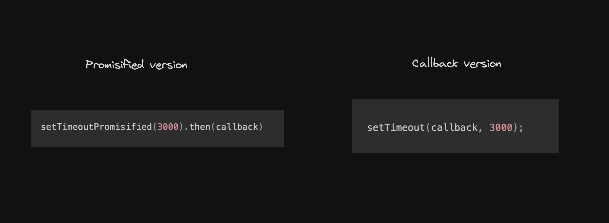

# FULLSTACK_WEBDEV
- https://github.com/Bharat2044/100xDevs-Cohort3-WebDev-and-Devops/blob/main/Lecture%20Slides.md
- https://app.100xdevs.com/courses/14
- 2-3 Years Work => Muscle Memory forever
- DevOps+ MERN => SDE2/ TECH LEAD/ STAFF ENGINEER LEVEL

## Table of Contents
- [FULLSTACK\_WEBDEV](#fullstack_webdev)
  - [Table of Contents](#table-of-contents)
  - [1 Orientation](#1-orientation)
    - [Course Overview](#course-overview)
    - [Student Level Classifications](#student-level-classifications)
    - [Development Environment](#development-environment)
    - [HTML Fundamentals](#html-fundamentals)
    - [CSS Fundamentals](#css-fundamentals)
    - [Flexbox Layout System](#flexbox-layout-system)
    - [CSS Classes and IDs](#css-classes-and-ids)
    - [Color Systems and RGB Values](#color-systems-and-rgb-values)
    - [CSS Margin and Padding Values](#css-margin-and-padding-values)
    - [Border Properties](#border-properties)
    - [Advanced CSS Concepts](#advanced-css-concepts)
    - [Browser Tools and Development](#browser-tools-and-development)
    - [Key Concepts Summary](#key-concepts-summary)
    - [Next Steps and Advanced Topics](#next-steps-and-advanced-topics)
  - [2 Javascript Basics](#2-javascript-basics)
    - [Javascript - The basics](#javascript---the-basics)
    - [Properties of JS](#properties-of-js)
    - [Syntax of Javascript](#syntax-of-javascript)
    - [Complex types](#complex-types)
  - [3 Asynchronous Javascript, Callbacks and more \[ONSIGHT\]](#3-asynchronous-javascript-callbacks-and-more-onsight)
    - [Intro](#intro)
    - [Normal functions in JS](#normal-functions-in-js)
    - [Synchronous code](#synchronous-code)
    - [I/O heavy operations](#io-heavy-operations)
    - [I/O bound tasks vs CPU bound tasks](#io-bound-tasks-vs-cpu-bound-tasks)
    - [Doing I/O bound tasks in the real world](#doing-io-bound-tasks-in-the-real-world)
    - [Concurrency vs Parallelism - Key Points from Rob Pike's Talk](#concurrency-vs-parallelism---key-points-from-rob-pikes-talk)
    - [Functional arguments](#functional-arguments)
    - [Asynchronous code, callbacks](#asynchronous-code-callbacks)
    - [Which will Executed First - Node.js Synchronous vs Asynchronous Execution Order](#which-will-executed-first---nodejs-synchronous-vs-asynchronous-execution-order)
    - [error-first callback](#error-first-callback)
    - [JS Architecture for async code](#js-architecture-for-async-code)
  - [4 Promises and async, await](#4-promises-and-async-await)
    - [Classes in JS](#classes-in-js)
    - [Inheritance in classes](#inheritance-in-classes)
    - [Some more classes](#some-more-classes)
    - [Promise class](#promise-class)
    - [Callback hell](#callback-hell)
    - [Async await syntax](#async-await-syntax)
    - [Defining your own async function](#defining-your-own-async-function)
    - [err first callback vs rejects in promises](#err-first-callback-vs-rejects-in-promises)
    - [Assignment](#assignment)
  - [5 Bash\& Terminal](#5-bash-terminal)

## 1 Orientation
```html
<html>
    <head>
        <title>Orientation</title>
        <link href="index.css" rel="stylesheet">
        <style>
            .toplink{
                text-align: center ;
            }
        </style>
    </head>
    <body style="background-color: aqua; ">
        <div>hi there</div>
        <span ><h2>Macbeth</h2> <h1> Introduction</h1> <a href="/">hi</a><a href="/">bye</a></span>
        <a href="/">hi</a><a href="/">bye</a>
        <span>-shakespear</span>
        <div style="display:flex ;justify-content:space-evenly; background-color:red ;cursor: pointer; padding: 200px; margin: 200px;" >
        
        <a href="/">hi</a><a href="/">bye</a>
        <div class="toplink">LLL</div>
        </div>
        <button>Download</button>
        <input type="text" placeholder="Search">
        
    </body>
</html>
```
```css
body{
    font-family: 'Lucida Sans', 'Lucida Sans Regular', 'Lucida Grande', 'Lucida Sans Unicode', Geneva, Verdana, sans-serif;
}
```

### Course Overview

- Goal

Make you incredibly solid at building and deploying Web apps.

---
- Cohort Projects

1. https://github.com/code100x/cms/ - Led by hsingh
2. https://github.com/code100x/daily-code/ - Led by Sargam
3. https://github.com/code100x/job-board - Led by Vineet
4. https://github.com/code100x/algorithmic-arena/pull/10 - Led by Nimit
5. Framer like app - Up for grabs

---

- Avoid the Spikes Strategy

1. We will go slow, today only focussing on HTML/CSS/JS
2. Any topic that you feel is missing / you want we will do polls from time to time we can add
3. Go slow but stay consistent, avoid the spikes

---
- What would I do if I was you?

1. Get to know people in discord, try to find a group of 3-4 motivated people
2. Look at all the success stories here and how they got a job - https://www.youtube.com/@100xDevs-n1w
3. Repeated advice - GSoC is the best internship you can do. Already start prepping for it competition is high. Tell me how can I help here we're hoping for ~50 GSoC selections from the cohort this year. Good video to watch - https://www.youtube.com/watch?v=OmzCvb-QBak

---
- Sprint Options

If things are going too slow you can:
1. Participate in projects/hackathons
2. Sprint through Cohort 2.0

### Student Level Classifications

- Complete Beginner (very basic/no coding before)
  - Things will be hard. You should spend ~20 hours/week at least on Cohort material, assignments, other content covering what we're doing in the Cohort. Don't slack off

---

- Intermediate (Done basic JS, HTML and some DSA)
  - You should be for the first ~10 weeks or so. We see major drop off after the first major project
  - Try chewing some glass after week 10, that is where you will actually learn things that differentiate you from a typical MERN developer

---

- Advanced (Know MERN decent/well)
  - Feel free to drop off for the first few weeks. I'll see you on Github. Participate in the Superteam hackathon, aim for GSoC this year. Already start looking at orgs

### Development Environment

- VSCode Installation
  - Download from here - https://code.visualstudio.com/

- Good Things to Hash Out
  1. Installing VSCode locally
  2. HTML/CSS
  3. Cloning the landing page of a simple website

- Step 1: Creating a Simple HTML File Locally
  1. Create a folder on your machine called `website`
  2. Add a `index.html` file inside it
  3. Write the following code in it

  ```html
  <html>
      <title>
          Visual Studio Code - Code Editor
      </title>
  </html>
  ```

  Now open this in your browser

### HTML Fundamentals

HTML stands for HyperText Markup Language. It is the foundation of building `unstyled` websites.

---

- not case sensitive
- sandwich code language
- `/` : root directory of website
- `<br/>` : eg of autoclosing tag

---

- Step 2: Tags

1. div, span
2. head
3. body
4. h1, h2, h3, h4, h5, h6
5. b, i, u
6. a
7. img
8. input
9. button
10. br

---

- HTML Tag Structure

```rust
html - root element
├── head - metadata container
│   ├── title - page title
│   └── style - internal styles
└── body - main content container
    ├── div - block-level container
    ├── span - inline container  
    ├── h1-h6 - headings (largest to smallest)
    ├── b, i, u - bold, italic, underline
    ├── a href - links to navigate
    ├── img src - embed images
    ├── input type - user input fields
    ├── button - clickable buttons
    └── br - line breaks
```

---

- Step 3: Building a Basic HTML Page

```html
<html>
    <title>
        Visual Studio Code - Code Editor
    </title>
</html>
<body>
    <div>
        <span>Visual Studio Code</span>
        <a href="/">Docs</a> 
        <a href="/">Updates</a> 
        <a href="/">Blog</a> 
        <a href="/">API</a> 
        <a href="/">Extensions</a> 
        <a href="/">FAQs</a>
        <a href="/">Learn</a>
        
        <input type="text" placeholder="Search Docs">
        <button>Download</button>
    </div>
    <br/>

    <div>
        <a href="/">Version 1.82</a> is now available! Read about the new features and fixes from July.
    </div>

    <br/>
</body>
```

### CSS Fundamentals

CSS stands for Cascading Style Sheets. It is used to style our applications.

---

- CSS Integration Methods

You can add CSS to your HTML app by using:
1. The `style` attribute (inline styles)
2. In an external css file

---

- Approach 1: Inline Styles

Try updating the `body` tag in the last style as follows:

```html
<body style="background-color: black;">
... rest of the code
</body>
```

---

- Approach 2: External Styles

1. Add a new file called index.css
2. Add the following code in it

```css
body {
    background-color: black;
}
```

---

> Priority: Inline styles >> External style

---

Update index.html:
```html
<html>
    <title>
        Visual Studio Code - Code Editor
    </title>
    <link rel="stylesheet" href="index.css">
</html>
<body>
... rest of the code
</body>
```

---

- Common Style Attributes
  - `color`: Sets the text color
  - `background-color`: Sets the background color  
  - `font-size`: Sets the size of the text
  - `margin`: Sets the outer space around an element
  - `padding`: Sets the inner space within an element
  - `border`: Sets the border around an element

### Flexbox Layout System

Flexbox is a CSS layout model designed to help with the arrangement of items within a container.

---

- Basic Flexbox Implementation

Update the website to the following:

```html
<html>
    <title>
        Visual Studio Code - Code Editor
    </title>
</html>
<body>
    <div style="display: flex;">
        <div>Visual Studio Code</div>
        <a href="/">Docs</a> 
        <a href="/">Updates</a> 
        <a href="/">Blog</a> 
        <a href="/">API</a> 
        <a href="/">Extensions</a> 
        <a href="/">FAQs</a>
        <a href="/">Learn</a>
    </div>
    <div>
        <input type="text" placeholder="Search Docs">
        <button>Download</button>
    </div>
    <br/>

    <div>
        <a href="/">Version 1.82</a> is now available! Read about the new features and fixes from July.
    </div>

    <br/>
</body>
```

Notice that the elements are positioned right next to each other even though `Visual Studio code` is inside a `div`.

---

- Justify Content Property

Try experimenting with the `justify-content` property:

```html
<html>
    <title>
        Visual Studio Code - Code Editor
    </title>
</html>
<body>
    <div style="display: flex; justify-content: space-between;">
        <div>Visual Studio Code</div>
        <a href="/">Docs</a> 
        <a href="/">Updates</a> 
        <a href="/">Blog</a> 
        <a href="/">API</a> 
        <a href="/">Extensions</a> 
        <a href="/">FAQs</a>
        <a href="/">Learn</a>
    </div>
    <div>
        <input type="text" placeholder="Search Docs">
        <button>Download</button>
    </div>
    <br/>

    <div>
        <a href="/">Version 1.82</a> is now available! Read about the new features and fixes from July.
    </div>

    <br/>
</body>
```

---

- Flexbox Properties from Note

- Display and Justify Content

```css
display: flex;                    /* Enable flexbox layout */
justify-content: flex-start;      /* Align items to start */
justify-content: flex-end;        /* Align items to end */
justify-content: center;          /* Center items */
justify-content: space-between;   /* Space items with gaps between */
justify-content: space-around;    /* Space items with equal space around */
justify-content: space-evenly;    /* Space items with even distribution */
```
```css
display: flex;                    /* Enable flexbox layout */

/* justify-content property controls main axis alignment */

justify-content: flex-start;      /* Align items to start */
/*
┌─────────────────────────────────┐
│ [A] [B] [C]                     │
└─────────────────────────────────┘
*/

justify-content: flex-end;        /* Align items to end */
/*
┌─────────────────────────────────┐
│                     [A] [B] [C] │
└─────────────────────────────────┘
*/

justify-content: center;          /* Center items */
/*
┌─────────────────────────────────┐
│          [A] [B] [C]            │
└─────────────────────────────────┘
*/

justify-content: space-between;   /* Space items with gaps between */
/*
┌─────────────────────────────────┐
│ [A]        [B]        [C]       │
└─────────────────────────────────┘
*/

justify-content: space-around;    /* Space items with equal space around */
/*
┌─────────────────────────────────┐
│[A]            [B]            [C]│
└─────────────────────────────────┘
*/

justify-content: space-evenly;    /* Space items with even distribution */
/*
┌─────────────────────────────────┐
│      [A]     [B]     [C]        │
└─────────────────────────────────┘
*/
```
- Advanced Flexbox Example

```html
<html>
</html>
<body>
    <header>
    </header>
    <section>
        <div style="border-width: thick; border-style: solid; display: flex; justify-content: space-between; margin-left: 200px; margin-right: 200px;">
            <div style="background: red;"> 
                <h1>Code with GitHub Copilot</h1>
                <h6>Write code faster and smarter with GitHub Copilot, your AI pair programmer.</h6>            
                Try GitHub Copilot free for 30 days
                Completions present suggestions automatically to help you code more efficiently.
                
                Copilot Chat understands the context of your code, workspace, extensions, settings, and more.
                
                Inline Chat enables you to iteratively generate edits and get answers to quick questions, directly on your code.
            </div>
            <div style="background: green;">
                
            </div>
        </div>
    </section>
    <footer>
    </footer>
</body>
```

### CSS Classes and IDs

In CSS, classes and IDs are used as selectors to apply styles to HTML elements. They help in targeting specific elements for styling and can be used to enhance the modularity and reusability of CSS code.

---

- Classes vs IDs Usage

---

- Classes (.) - Reusable Styles

```html
<span class="toplink">Docs</span>
<span class="toplink">Updates</span>
```

```css
.toplink {
    color: gray;
}
```

---


- IDs (#) - Unique Elements

```html
<div id="header">Content</div>
```

```css
#header {
    background-color: blue;
}
```
### Color Systems and RGB Values
- You can create any color with combination of Red, Blue, Green
- RGB is a color model used to represent colors in digital displays
- r (0 - 255), g (0 - 255), b (0 - 255) [min- max values]

---

- RGB Color Model

```css
rgb(255, 0, 0)     /* Red */
rgb(0, 255, 0)     /* Green */  
rgb(0, 0, 255)     /* Blue */
rgb(255, 255, 0)   /* Yellow */
rgb(255, 0, 255)   /* Purple */
rgb(0, 255, 255)   /* Cyan */
```

---

- RGBA with Transparency

```css
rgba(255, 0, 0, 0.5)   /* Semi-transparent red */
rgba(0, 0, 0, 0.3)     /* Semi-transparent black */
```

---

- Hex Color Codes

```css
#FF0000   /* Red */
#00FF00   /* Green */
#0000FF   /* Blue */
#FFFF00   /* Yellow */
```

### CSS Margin and Padding Values

```css
margin: 10px;           /* All sides 10px */
margin: 10px 20px;      /* Top/bottom 10px, left/right 20px */
margin: 10px 20px 30px; /* Top 10px, left/right 20px, bottom 30px */
margin: 10px 20px 30px 40px; /* Top, right, bottom, left */

padding: 15px;          /* All sides 15px */
padding: 10px 20px;     /* Top/bottom 10px, left/right 20px */
```

### Border Properties

```css
border: 1px solid black;        /* Width style color */
border-width: thick;            /* Border thickness */
border-style: solid;            /* Border style */
border-color: red;              /* Border color */
```

### Advanced CSS Concepts

- Font and Text Properties

```css
font-size: 16px;               /* Text size */
font-weight: bold;             /* Text weight */
text-align: center;            /* Text alignment */
text-decoration: underline;    /* Text decoration */
```

---

- Background Properties

```css
background-color: black;       /* Background color */
background: red;               /* Shorthand background */
```

---

- Element Positioning and Layout

```css
margin-left: 200px;           /* Left margin */
margin-right: 200px;          /* Right margin */
width: 800px;                 /* Element width */
```

---

- CSS Selectors Hierarchy

```
Element Selectors:
├── Tag selectors: div, span, body
├── Class selectors: .classname
├── ID selectors: #idname
└── Attribute selectors: [type="text"]
```

### Browser Tools and Development

---

- Google Chrome Developer Tools

---

- Right-click → Inspect Element
- F12 or Ctrl+Shift+I
- Elements tab for HTML structure
- Styles tab for CSS properties

---

- File Structure Organization

```
website/
├── index.html
├── index.css
├── images/
└── js/ (for future JavaScript)
```

---

- HTML Document Structure Best Practices

```html
<!DOCTYPE html>
<html>
<head>
    <title>Page Title</title>
    <style>
        /* Internal styles */
    </style>
    <link rel="stylesheet" href="index.css">
</head>
<body>
    <!-- Page content -->
</body>
</html>
```

### Key Concepts Summary

---

- HTML Core Concepts
  - HyperText Markup Language foundation
  - Tag-based structure with opening/closing tags
  - Semantic elements for content organization
  - Attributes provide additional information

---

- CSS Core Concepts  
  - Cascading Style Sheets for presentation
  - Selectors target HTML elements
  - Properties define visual characteristics
  - Values specify property settings

---

- Flexbox Layout Model
  - Modern CSS layout system
  - Container and item relationship
  - Main axis and cross axis alignment
  - Flexible item sizing and positioning

---

- Development Workflow
  1. Create HTML structure
  2. Add CSS styling
  3. Test in browser
  4. Iterate and refine
  5. Validate code quality

### Next Steps and Advanced Topics

- Upcoming Technologies
  - JavaScript for interactivity
  - Responsive design principles
  - CSS Grid layout system
  - Modern development tools

- Project Milestones
  - Clone simple website landing pages
  - Build responsive layouts
  - Implement interactive features
  - Deploy to web hosting platforms

- Learning Resources
  - 100xDevs community Discord
  - YouTube success stories and tutorials
  - GitHub project repositories
  - GSoC preparation materials

## 2 Javascript Basics
```js
// variable
// let
// can be reassigned
let name = "Bali";
name ="Siddhant ";

// constants
// cannot be reassigned
// make code more stricter
const name2 = "Bhati";
const age=21 ;
// age=22; //TypeError: Assignment to constant variable.

// console.log() //print method
// it has default newline/linebreak
console.log(age); //21
console.log("age") //age

// var
// older way to define variables
// function scoped 
// please don't use it
// forget it
var name3 = "Bhaskar";

var isStudent=true;
console.log(isStudent); //true

// keyword = reserved words in lang to do somestuff
// deprecated = used here to support already existing code, but is not advised to use 

// js is line-to-line interpreated lang
// it will run till crash occour ,then stop
// but it will execute till crash error come

// comment
// ; means statement end

// DataTypes
let no=42; //number
let str="String";// String
let boo=true;// boolean
let arr3=[1,2,3];//array
console.log(arr3[3]); //undefined

// Operators
let sum = 1+5; //arithmatic
let isEqual= (1===10); //comparison operator
let isTrue = (true&&false) //logical operator

// == ,!= , Loose equality , typecasting , return true even type is different
console.log('5'==5, null==undefined, false==0); //true true true
// === ,!== , Strict equality , compare both value and type without any type conversion , return true only both value and type are EXACT
console.log('5'===5, null===undefined, false===0, 5===5); //false false false true

// Function, workers/helpers, that can be use any number of times
// only executed when called :)
function greet0(name) {console.log("Hi, ",name,"!!")}
let name4 = "Bali"
greet0(name4); //Hi,  Bali !!

function sum1(n1,n2){return n1+n2;}
console.log(sum1(1,5)); //6
console.log(sum1(1,"o1")); //1o1 
// this is called string concatnation

function sum11(n1,n2){return parseInt(n1)+parseInt(n2);}
// if args ,then it will parseInt
// parseInt : is a function that converts a string into an integer number
// "42" => 42, "42sfsdfs" => 42, "meow" => NaN 
console.log(sum11(1,5)); //6
console.log(sum11(1,"o1")); //NaN

function isEven ( n1){
    // If Else
    if (n1%2===0){return true;} // % mod operator,gives remainder
    if (n1%2!==0){return false;}
}

console.log(isEven(10),isEven(11)); //true false

// for loop 
for (var i =0; i<5; i++){
    console.log(i);
}

// while loop
var i1=5;
while(i1--){
    console.log(i1)
}


// complex data types
// objects, key value pairs {stingKey:valueAnyDatatype}
let user = {userName:"Rijusmit",userAge:20};
console.log("Hi "+user["userName"]+" Brother,you have age:"+user.userAge); // user["userName"] = user.userName, you can use any

function greet(user)// accepting not primitive but complex datatype
{
    console.log("Hi "+user.userName+" Brother,you have age:"+user.userAge);
}

let user1 = {userName:"Bhati",userAge:21};
greet(user1);

// Array, help to grp data together
let arr= [1,2,3];
const lenArr= arr.length;
console.log(arr,lenArr); //[ 1, 2, 3 ] 3

// Array of Objects, more complex :)
const user2= [{userName:"Bhaskar",userAge:20},{userName:"Kintsugi",userAge:21}];
let user3 = user2[0].userName;
let user3all = user2[0];
console.log(user3,user3all); //Bhaskar { userName: 'Bhaskar', userAge: 20 }

let arr2= ["Bali",21,{userName:"Bhaskar",userAge:20}];
let let1 = arr2[2];
let let2 =  {userName:"Bhaskar",userAge:20} ;
console.log(let1,let2); // { userName: 'Bhaskar', userAge: 20 } { userName: 'Bhaskar', userAge: 20 } // litrally same thing


// Object of Objects
let user4 = {userName:"Bhaskar",userAge:20,userAddress:{city:"Delhi", country: "India", pin:110091}};
const city= user4.userAddress.city;
const city2= user4["userAddress"]["city"];
console.log(city,city2); // Delhi Delhi //Same :)

// create a function that takes an arr of a obj as input and return the users who age>18 and are male
const users1 =[
    // {userName:"Bhaskar",userAge:20,userGender:"Male"},
    {userName:"DoggoBhai",userAge:2,userGender:"Male"},
    {userName:"IIITDBilli",userAge:5,userGender:"Female"},
];

function maleAdultChecker(users1){
    return users1.filter( // return array
        users1=>
        users1.userAge>=18 && users1.userGender==="Male"); //[ { userName: 'Bhaskar', userAge: 20, userGender: 'Male' } ]
}
function maleAdultChecker2(users1){
    for (let i=0; i<users1.length; i++){ //return object
        if (
            users1[i]["userAge"] >= 18
            &&
            users1[i]["userGender"] === "Male"
        )
            return users1[i]; //{ userName: 'Bhaskar', userAge: 20, userGender: 'Male' }
    } 
    return 0;
}

console.log(maleAdultChecker(users1),maleAdultChecker2(users1)); // [ { userName: 'Bhaskar', userAge: 20, userGender: 'Male' } ] { userName: 'Bhaskar', userAge: 20, userGender: 'Male' } //NOTsame
// [] 0 // in case no Bhaskar entry 

```
### Javascript - The basics

---

- Web development

Web development involves writing a lot of HTML, CSS and JS code. 
Historically (and even today to some extend), browsers could only understand HTML, CSS and JS
Any website that you see, is a bunch of HTML, CSS and JS files along with some assets (images, videos etc)
 
```
                    ┌─────────────────────────────────────────────┐
                    │                                             │
                    │           G O O G L E                       │
     ┌─────────┐    │                                             │
     │         │    │    ┌───────────────────────────────────┐    │
     │  HTML   │────┼───▶│                                   │    │
     │  CSS    │    │    │         [Search Box]              │    │
     │  JS     │    │    │                                   │    │
     │ Images  │    │    │    ┌─────────────────────────┐    │    │
     │         │    │    │    │     Special Doodle      │    │    │
     └─────────┘    │    │    │    (Holiday/Event)      │    │    │
                    │    │    └─────────────────────────┘    │    │
                    │    │                                   │    │
                    │    │[Google Search][I'm Feeling Lucky] │    │
                    │    │                                   │    │
                    │    └───────────────────────────────────┘    │
                    │                                             │
                    │  India                                      │
                    │                                             │
                    │  Advertising  Business  How Search works    │
                    │                          Privacy  Terms     │
                    └─────────────────────────────────────────────┘
```

---

- Facts/Callouts

React, NextJS are frameworks . They compile down to HTML, CSS, JS in the end. That is what your browser understands.
When you run your C++ code on leetcode , it does not run on your browser/machine. It runs somewhere else. Your browser can’t (almost) compile and run C++ code.
If someone asks — What all languages can your browser interpret, the answer is HTML, CSS, JS and WebAssembly. It can, technically, run C++/Rust code that is compiled down to Wasm

---

- Before we proceed, do one of the following  

Create an account on replit
Install Node.js locally
Keep your browser console open for testing locally

### Properties of JS
Every language comes with it’s unique set of features. 
- Javascript has the following -

---

- 1. Interpreted
 JavaScript is an interpreted language, meaning it's executed line-by-line at runtime by the JavaScript engine in the browser or server environment, rather than being compiled into machine code beforehand.
```
C++ Code
┌─────────────────┐         ┌─────────┐                    Runs on
│                 │────────▶│         │───────────────────▶your machine
│                 │         │ Binary  │
│                 │         │         │
│                 │         └─────────┘
└─────────────────┘


JS Code
┌─────────────────┐
│                 │───────────────────────────────────────▶Runs on
│                 │                                        your machine
│                 │
└─────────────────┘
```
 
- Upsides - There is one less step to do before running your code
- Downsides - Performance Overhead:More prone to runtime errors

---

- 2. Dynamically Typed
 Variables in JavaScript are not bound to a specific data type. Types are determined at runtime and can change as the program executes
C++ Code (won’t compile)
```cpp
#include <iostream>

int main() { 
  int a = 1;
  a = "hello";
  a = true;
}
```

JS Code (will compile)
```js

var a = 1;
a = "Doraemon";
a = true;

console.log(a)
```
- cpp code is statically typed
- js code is dynamically typed
- Rust
  - do ownership checks
  - compiler very strict
  - extreme memory safe
  - extreme slow compile
 
---

- 3. Single threaded
JavaScript executes code in a single-threaded environment, meaning it processes one task at a time. We will dive deeper into this next week.
```
+-------------------------+    +-------------------------+
|     ( Rust / C++ )      |    |     ( index.js )        |
|                         |    |                         |
|   [CPU1*][CPU2*][CPU3*] |    |   [CPU1*][cpu2] [cpu3]  |
|   [CPU4*][CPU5*][CPU6*] |    |   [cpu4] [cpu5] [cpu6]  |
|   [CPU7*][CPU8*][CPU9*] |    |   [cpu7] [cpu8] [cpu9]  |
|                         |    |                         |
|  * All CPUs in use      |    |  * Only one CPU in use  |
+-------------------------+    +-------------------------+

```

- even JS infinite loop(most expensive operation :0 ) can utilize max only 1CPU !!! 
- (do htop ;0 )
  - at htop, nodejs process => 98% CPU
  - it uses ~100%CPU out of `100% * number of CPUs total`
  - eg: i have 20 CPU Cores, uses 98% nodejs app, from 20*100 % total= 2000% total CPU space
  - `Rust/ C++`(Multithreaded) can go to 200%, 300% etc.
  - `ffmpeg`(c++ ) go upto 300% / even use full CPUs
- to reduce JS Runtime errors, TS was introduced
  - TS(Like C++) =(compile)> JS => Run
  - it reduces disadvantages 
- companies go from JS to Rust, Golang for
  - faster Run
  - Max. Safety

---

- 4. Garbage collected
```
+---------------------------------------------------------------+
|                       Memory Management                       |
+-------------------+-------------------+-----------------------+
| Garbage Collector | Manual            | The Rust Way          |
|-------------------|-------------------|-----------------------|
| 1. Written by     | 1. You allocate   | 1. Rust has its own   |
|    smart people   |    and deallocate |    ownership model    |
| 2. No dangling    |    memory yourself|    for memory mgmt    |
|    pointers issue | 2. Can lead to    | 2. Extremely safe     |
| 3. No manual      |    dangling ptrs  |    from memory errors |
|    memory mgmt    |    / memory issues|                       |
| 4. Ex: Java, JS   | 3. Hard learning  |                       |
|                   |    curve          |                       |
|                   | 4. Ex: C          |                       |
+-------------------+-------------------+-----------------------+

```
JavaScript automatically manages memory allocation and deallocation through garbage collection, which helps prevent memory leaks by automatically reclaiming memory used by objects no longer in use.
 
- garbage collection does
  - stores data
  - change data
  - removing data
- code runs in RAM

 
---

- Conclusion
Is JS a good language?
Yes and no. It is beginner friendly, but has a lot of performance overhead. Bun is trying to solve for a lot of this, but there’s a long way to go before JS can compete with languages like C++/Rust


### Syntax of Javascript

---

- 1. Variables
Variables are used to store data. In JavaScript, you declare variables using var, let, or const.
```ja
let name = "John";     // Variable that can be reassigned
const age = 30;        // Constant variable that cannot be reassigned
var isStudent = true;  // Older way to declare variables, function-scoped
```
- let, const helps to make code more stricter, when used logically correctly
- deprecated
  - disapproved / "don't use it"
  - Something that's still tolerated or accepted to support already written code , but it's not recommended or highly discouraged
- keywords
  - reserved words in JS not to use as var name
---

- Assignment
Create a variable for each of the following: your favorite color, your height in centimeters, and whether you like pizza. Use appropriate variable declarations (let, const, or var). Try logging it using console.log

---

- 2. Data types
```js
let number = 42;             // Number
let string = "Hello World";  // String
let isActive = false;        // Boolean
let numbers = [1, 2, 3];     // Array
```

---

- 3. Operators
```js
let sum = 10 + 5;          // Arithmetic operator
let isEqual = (10 === 10); // Comparison operator
let isTrue = (true && false); // Logical operator
```

---

- 4. Functions
```js
// Function declaration
function greet(name) {
    return "Hello, " + name;
}

// Function call
let message = greet("John"); // "Hello, John"
```
- js will not run/read function at 1st
- only run/read when called
- i.e. if written wrong function, it won't show error until called
---
- Assignment #1
Write a function sum that finds the sum of two numbers. 
Side quest - Try passing in a string instead of a number and see what happens?
Assignment #2
Write a function called canVote that returns true or false if the age of a user is > 18

---

- 5. If/Else
```js
if (age >= 18) {
    console.log("You are an adult.");
} else {
    console.log("You are a minor.");
}
```

---

- Assignment
Write an if/else statement that checks if a number is even or odd. If it's even, print "The number is even." Otherwise, print "The number is odd."


---

- 6. Loops
```js
// For loop
for (let i = 0; i < 5; i++) {
    console.log(i); // Outputs 0 to 4
}

// While loop
let j = 0;
while (j < 5) {
    console.log(j); // Outputs 0 to 4
    j++;
}
```
 
---

- Assignment
Write a function called sum that finds the sum from 1 to a number

### Complex types
- Objects
An object in JavaScript is a collection of key-value pairs, where each key is a string and each value can be any valid JavaScript data type, including another object.
 
```
+-------------------------------------------+
|                                           |
|   let user = {                            |
|       name: "Doraemon",   <--- key:value  |
|       age: 19                             |
|   }                                       |
|                                           |
|   key  --->  "name"                       |
|   value --->  "Doraemon"                  |
+-------------------------------------------+

```
```js
let user = {
	name: "Doraemon",
	age: 19
}

console.log("Doraemons age is " + user.age);
```

---

- Assignment #1
Write a function that takes a user as an input and greets them with their name and age

---

- Assignment #2
Write a function that takes a new object as input which has name , age  and gender and greets the user with their gender (Hi Mr/Mrs/Others Doraemon, your age is 21)

---

- Assignment #3
Also tell the user if they are legal to vote or not

---

- Arrays
Arrays let you group data together
```js
const users = ["Doraemon", "raman", "diljeet"];
const tatalUsers = users.length;
const firstUser = users[0];
```

---

- Assignment
Write a function that takes an array of numbers as input, and returns a new array with only even values. Read about filter in JS

---

- Array of Objects
We can have more complex objects, for example an array of objects
```js
const users = [{
		name: "Doraemon",
		age: 21
	}, {
		name: "raman",
		age: 22
	}
}

const user1 = users[0] 
const user1Age = users[0].age
```
- `user1.name` , `user1[name]` both works in JS

---

- Assignment
Write a function that takes an array of users as inputs and returns only the users who are more than 18 years old

---

- Object of Objects
We can have an even more complex object (object of objects)
```js
const user1 = {
	name: "Doraemon",
	age: 19,
	address: {
		city: "Delhi",
		country: "India",
		address: "1122 DLF"
	}
}

const city = user1.address.city;
```

---

- Assignment
Create a function that takes an array of objects as input,
and returns the users whose age > 18 and are male

---

- Arrays in js
  - = arr/vector in C++
  - = vectors in rust
  - = arraylist in java
- Objects in js
  - = Map in C++
  - = Hashmaps in Rust
  - = Hashmaps in JAVA


## 3 Asynchronous Javascript, Callbacks and more [ONSIGHT]

### Intro
- Goal of todays class:
  - I/O tasks
  - Callbacks
  - Functional arguments
  - Async vs Sync codeEvent loops, callback queues, JS
  - Goal of tomorrows class
  - Async await, Promises
  - Practising async JS
 
Hopefully, by the end of the class, you are able to understand the following code:

---

- Functional arguments

```js
function sum(a, b) {
  return a + b;
}

function multiply(a, b) {
  return a * b;
}

function subtract(a, b) {
  return a - b;
}

function divide(a, b) {
  return a / b;
}

function doOperation(a, b, op) {
  return op(a, b)
}

console.log(doOperation(1, 2, sum))
```

---

- Callbacks
```js
const fs = require("fs");

fs.readFile("a.txt", "utf-8", function (err, contents) {
  console.log(contents);
});
```

### Normal functions in JS
The way to write functions in JS is as follows - 
Find sum of two numbers
```js
function sum(a, b) {
	return a + b;
}

let ans = sum(2, 3)
console.log(sum);
```
 
> In JavaScript, just writing a function doesn’t do anything immediately; it only defines the function. The function’s code will not run until the function is actually called (or invoked).

```js
function sum1(n1,n2){return n1+n2;}
console.log(sum1(1,5)); //6
console.log(sum1(1,"o1")); //1o1 
// this is called string concatnation

function sum11(n1,n2){return parseInt(n1)+parseInt(n2);}
// if args ,then it will parseInt
// parseInt : is a function that converts a string into an integer number
// "42" => 42, "42sfsdfs" => 42, "meow" => NaN 
console.log(sum11(1,5)); //6
console.log(sum11(1,"o1")); //NaN

```
---

Find sum from 1 to a number
```js
function sum(n) {
	let ans = 0;
	for (let i = 1; i <= n; i++) {
		ans = ans + i
	}
	return ans;
}

function sum1(n){
  return n*(n+1);
}


const ans = sum(100);
console.log(ans);
```

### Synchronous code
- Synchronous code is executed line by line, in the order it's written. 
- Each operation waits for the previous one to complete before moving on to the next one.

---

For example
```js
function sum(n) {
	let ans = 0;
	for (let i = 1; i <= n; i++) {
		ans = ans + i
	}
	return ans;
}

const ans1 = sum(100);
console.log(ans1);
const ans2 = sum(1000);
console.log(ans2);
const ans3 = sum(10000);
console.log(ans3);
```

### I/O heavy operations
> sync i-o tasks => performance downside

- I/O (Input/Output) heavy operations refer to tasks in a computer program that involve a lot of data transfer between the program and external systems or devices.
- These operations usually require waiting for data to be read from or written to sources like disks, networks, databases, or other external devices, which can be time-consuming compared to in-memory computations.

- Examples of I/O Heavy Operations:
  - Reading a file
  - Starting a clock
  - HTTP Requests 
 
> HTTP Requests can be seen from Networks Tab in Dev Console

> 💡 We’re going to introduce imports/requires next. A require statement lets you import code/functions export from another file/module.
 
---

Let’s try to write code to do an I/O heavy operation - 
- Open repl.it
- Create a file in there (a.txt) with some text inside
- Write the code to read a file synchronously
```js
// filesystem nodejs library, external library, need to import
const fs = require("fs");// import it 
// 35
const contents = fs.readFileSync("a.txt", "utf-8"); // fs is object here, having key readFileSync leads to a func.
// an I/O heavy operation
// outside js code context
// comm. with os
// utf-8 encoding

// in-memory computations; is typical js code var ops like; var a = "joe";
console.log(contents);
```

> The "utf-8" argument in fs.readFileSync tells Node.js to decode the raw buffer (bytes) into a human-readable string instead of returning the binary buffer.

```
case 1: fs.readFileSync("a.txt", "utf-8")
     +--------------------+
     | File: a.txt        |
     | Content: hi there  |
     +--------------------+
                |
                v
      fs.readFileSync("a.txt", "utf-8")
                |
                v
        "hi there"   <-- String (decoded text)

case 2: fs.readFileSync("a.txt")
     +--------------------+
     | File: a.txt        |
     | Content: hi there  |
     +--------------------+
                |
                v
        fs.readFileSync("a.txt")
                |
                v
    <Buffer 68 69 20 74 68 65 72 65>
         (hex representation)
                |
                +--> 68 = 'h'
                +--> 69 = 'i'
                +--> 20 = ' ' (space)
                +--> 74 = 't'
                +--> 68 = 'h'
                +--> 65 = 'e'
                +--> 72 = 'r'
                +--> 65 = 'e'

- With "utf-8" → you directly get a string ("hi there")
- Without "utf-8" → you get a Buffer object (raw binary data, stored in hex)
```
---

- Create another file (b.txt)
- Write the code to read the other file synchronously
```js
const fs = require("fs");

const contents = fs.readFileSync("a.txt", "utf-8");
console.log(contents);
// may take 10sec if big data,slow machine
// performance downside

const contents2 = fs.readFileSync("b.txt", "utf-8");
console.log(contents2);
```

---

> 💡What is wrong in this code above?

### I/O bound tasks vs CPU bound tasks

---

- CPU bound tasks

CPU-bound tasks are operations that are limited by the speed and power of the CPU. These tasks require significant computation and processing power, meaning that the performance bottleneck is the CPU itself.
```js
let ans = 0;
for (let i = 1; i <= 1000000; i++) {
	ans = ans + i
}
console.log(ans);	
```
> 💡A real world example of a CPU intensive task is running for 3 miles. Your legs/brain have to constantly be engaged for 3 miles while you run.

---

- I/O bound tasks

I/O-bound tasks are operations that are limited by the system’s input/output capabilities, such as disk I/O, network I/O, or any other form of data transfer. These tasks spend most of their time waiting for I/O operations to complete.
```js
const fs = require("fs");

const contents = fs.readFileSync("a.txt", "utf-8");
console.log(contents);
```
> 💡 A real world example of an I/O bound task would be Boiling water. I don’t have to do much, I just have to put the water on the kettle, and my brain can be occupied elsewhere.

### Doing I/O bound tasks in the real world
What if you were tasked with doing 3 things
- Boil some water.
- Do some laundry
- Send a package via mail

---

Would you do these 
- One by one (synchronously)
- Context switch between them (Concurrently)
- Start all 3 tasks together, and wait for them to finish. The first one that finishes gets catered to first.
 
> 💡Good talk - Concurrency is not parallelism  - https://www.youtube.com/watch?v=oV9rvDllKEg

### Concurrency vs Parallelism - Key Points from Rob Pike's Talk

```
Core Concepts
-------------
Concurrency vs Parallelism - The Fundamental Difference
- Concurrency: A way to structure/build things - composition of independently executing processes
- Parallelism: Simultaneous execution of multiple things (possibly related, possibly not)
- Key insight: Concurrency is about dealing with lots of things at once; Parallelism is about doing lots of things at once
- Concurrency is about structure; Parallelism is about execution
- Concurrency enables parallelism but parallelism is NOT the goal of concurrency

Why This Matters
- The world is inherently concurrent/parallel (multicore machines, networking, planets, universe)
- Current programming tools don't express this worldview well
- Common misconception: programmers think concurrency = parallelism and get disappointed when adding processors makes programs slower

Real-World Analogies
--------------------
Operating System Example
- Mouse driver, keyboard driver, display driver, network drivers
- All managed as independent concurrent things by OS kernel
- Not necessarily parallel (on single processor, only one runs at a time)
- Concurrent model doesn't require parallelism

Vector Dot Product Example
- Can be broken into microscopic parallel operations
- Executed simultaneously on specialized hardware
- Pure parallelism, not concurrency

The Gopher Book-Moving Analogy
------------------------------
Single Gopher Problem
- One gopher moving books from pile to incinerator
- Slow process, needs tools (cart)

Two Gophers with Carts
- Faster execution but need synchronization
- Coordination required to avoid conflicts
- Shows basic concurrent composition

Three-Gopher Pipeline
- Loader gopher → Carrier gopher → Unloader gopher
- Different concurrent design, potentially more efficient
- Pipeline approach with specialized roles

Four-Gopher Optimized Pipeline
- Added return-cart gopher
- Key insight: Adding more work (another gopher) can make system faster
- Better concurrent composition leads to improved performance
- Parallelism emerges from better concurrent expression

Scaling Patterns
- Can scale by duplicating entire systems (8 gophers)
- Can add staging areas for different concurrent designs
- Multiple dimensions of parallelization possible (up to 16 gophers)
- Many valid concurrent designs for same problem

Programming Language Context - Go
--------------------------------
Go Routines
- Like threads but much cheaper and lighter weight
- Multiplexed dynamically onto OS threads
- Easy to create thousands (debugging session had 1.3 million go routines)
- Launched with 'go' keyword before function call

Channels
- Communication mechanism between go routines
- Typed, like pipes but with additional properties
- First-class values that can be passed around
- Enable coordination without explicit locking

Select Statement
- Multi-way concurrent control switch
- Listen to multiple channels simultaneously
- Choose based on which channel is ready
- Includes default clause for non-blocking behavior

Practical Examples
------------------
Simple Load Balancer
- Workers read from input channel, write to output channel
- Arbitrary number of concurrent workers
- No explicit synchronization needed
- Scales from 1 to 1000+ processors automatically

Advanced Load Balancer
- Requesters generate work with embedded return channels
- Workers handle requests and return results directly
- Balancer uses heap to track worker loads
- Direct communication bypasses balancer after initial routing
- No explicit locking required

Replicated Database Query
- Send query to multiple database replicas simultaneously
- Return first response received
- Handles failures automatically (other replicas continue)
- Complete implementation in just a few lines

Key Principles
--------------
Communication and Coordination
- Concurrency requires communication between independent pieces
- Tony Hoare's 1978 paper "Communicating Sequential Processes" is foundational
- Languages like Erlang and Go implement these ideas

Design Benefits
- Multiple valid concurrent designs for any problem
- Designs can be refactored and scaled in different dimensions
- Correctness is maintained regardless of parallelization level
- Parallelism becomes a "free variable" once concurrency is right

Performance Insights
- Adding concurrent procedures can improve performance even with more total work
- Better concurrent decomposition enables more effective parallelization
- No need to think about parallelism when designing concurrent solutions

Programming Best Practices
--------------------------
What Concurrency Enables
- Scalable architectures without explicit locking
- Natural expression of inherently concurrent problems
- Automatic load balancing and resource utilization
- Graceful handling of failures and varying loads

Real-World Applications
- Web serving architectures (substitute gophers→CPUs, books→web content, carts→networking)
- Distributed systems and microservices
- Pipeline processing and data streaming
- Fault-tolerant system design

Conclusion Points
-----------------
- Concurrency is powerful but it's not parallelism
- Concurrency enables parallelism and makes parallelism easy
- Focus on correct concurrent structure first, parallelism follows naturally
- Tools and language support (like Go) make concurrent programming accessible

Recommended Reading
-------------------
- Tony Hoare's "Communicating Sequential Processes" (1978) - foundational paper
- golang.org for Go language resources
- Bob Harper's blog post "Parallelism is not Concurrency"
- Doug McIlroy's concurrent power series work
- Sawzall language (parallel without concurrency)

```
---

- Synchronously (One by one)
```js
const fs = require("fs");

const contents = fs.readFileSync("a.txt", "utf-8");
console.log(contents);

const contents2 = fs.readFileSync("b.txt", "utf-8");
console.log(contents2);

const contents3 = fs.readFileSync("b.txt", "utf-8");
console.log(contents3);
```
```
SYNC
----
 Start
   |
Read a.txt
   |
 print
   |
Read b.txt
   |
 print
   |
Read a.txt
   |
 print
   |
  End

- Tasks happen one after another, blocking the flow.
```
---
- Asynchronously 
- Start all 3 tasks together, and wait for them to finish.
```js
const fs = require("fs");

fs.readFile("a.txt", "utf-8", function (err, contents) {
  console.log(contents);
});

fs.readFile("b.txt", "utf-8", function (err, contents) {
  console.log(contents);
});

fs.readFile("a.txt", "utf-8", function (err, contents) {
  console.log(contents);
});

```
```
ASYNC
-----
        Start
          |
   -----------------
   |       |       |
Read a   Read b   Read a
   |       |       |
 (cb)    (cb)    (cb)
   |       |       |
 print   print   print

        End (main thread doesn’t wait)

- Tasks branch out in parallel, main thread ends while callbacks finish later.
```
> with Async func.s ; PERFORMANCE MASSIVE BOOSTS ( no bottlenecks ) !!!
### Functional arguments
Write a calculator program that adds, subtracts, multiplies, divides two arguments.

---

- Approach #1
- Calling the respective function
```js
function sum(a, b) {
  return a + b;
}

function multiply(a, b) {
  return a * b;
}

function subtract(a, b) {
  return a - b;
}

function divide(a, b) {
  return a / b;
}

console.log(sum(1, 2)) // useage
```

---

- Approach #2
- Passing a function to another function as a arguement
```js
function sum(a, b) {
  return a + b;
}

function multiply(a, b) {
  return a * b;
}

function subtract(a, b) {
  return a - b;
}

function divide(a, b) {
  return a / b;
}


// Functional arguments
// Passing a function to another function as a arguement
function doOperation(a, b, op) {
  // WOW , func. name as arg

  // during use; eg: 
  // console.log(doOperation(1, 2, sum))
  
  // a =1
  // b= 2
  // op=divide // WOW WOW WOW
  let val = op(a,b);

  return val;
}
// wow
// doOperation(a, b, op)
//    a=1 , b=2
//         |
//         v
//       [ op ]  ---> sum / subtract / multiply / divide
//         |
//         v
//      result

function doOperationSimple(a, b, op) {
  return op(a, b)
}
console.log(doOperation(1, 2, sum))
```
--- 

```
Approach #1:   a,b ---> sum()       ---> result
Approach #2:   a,b,op ---> doOperation(op) ---> result

```
> if you pass anything other than functions made in code as func. args. you will get error

> Using functions as arguments (functional arguments) is useful when you want to make your code more flexible and reusable; rather than writing separate logic for every case, you can pass a function into another function to decide what exact operation to perform at runtime. This is especially helpful when you don’t know in advance which operation is required, or when the same “workflow” needs to handle many possible operations.

> if you understand func. args. ,callbacks will be easy.

> if you understand callbacks ,async will be easy.
### Asynchronous code, callbacks
Let’s look at the code to read from a file asynchronously. Here, we pass in a function as an argument. This function is called a callback since the function gets called back when the file is read 
```
const fs = require("fs");

function afterFileRead(err, contents) {
    console.log(contents);
}

fs.readFile("a.txt", "utf-8", afterFileRead);
                  |         |           |
                  |         |           |
               string    string      function

```
A **callback function** is a function that is **passed in as an argument** to another function.

The function is named a callback because it is the function that **gets called back** (executed) after the main operation has finished its work.

Key characteristics based on the sources:

*   **Argument and Execution:** When reading a file asynchronously, for example, a function is provided as an argument. This argument function is the callback.
*   **Timing:** The function is called back when the first function (which it was fed into, such as `fs.readFile`) has completed its process, like finishing the file read.
*   **Role:** After the initial function has **done its work**, it will then call back the function which was supplied to it as an argument.

In code examples provided, functions like `afterFileRead` or an inline anonymous function passed to `fs.readFile` serve as the callback function.

---

```js
// eg
const fs = require("fs");

fs.readFile(
  "a.txt", 
  "utf-8", 
  function (err, contents) { // callback function 
    console.log(contents);
  }
);
```

---

- setTimeout
- setTimeout is another asynchronous function that executes a certain code after some time
```js
function run() {
	console.log("I will run after 1s");
}

setTimeout(run, 1000);
console.log("I will run immedietely");
```
---
### Which will Executed First - Node.js Synchronous vs Asynchronous Execution Order
> Q. Explain the order of execution for the output statements. Which message will be printed first, and why?
```js
const fs = require("fs");

function print(err, data) {
    console.log(data);
}

fs.readFile("a.txt", "utf-8", print); // asynchronously
fs.readFile("b.txt", "utf-8", print); // asynchronously

console.log("Done!");

setTimeout(() => {
    console.log("hello")
}, 0)

```
In this Node.js code, `console.log("Done!")` will be executed first, before any of the asynchronous operations (`fs.readFile` and `setTimeout`). 

-  Explanation
   - `console.log("Done!")` is a simple synchronous statement, so it runs immediately during the initial pass of the code.
   - `fs.readFile` is asynchronous, so its callback (the `print` function) will be queued for later execution, after the file is read.
   - `setTimeout(..., 0)` is also asynchronous; its callback gets queued in the event loop to run after all synchronous code has run.
-  Execution order in output:
   1. `console.log("Done!")` runs first.
   2. The `setTimeout` callback (`console.log("hello")`) typically runs next, after the current synchronous code completes.
   3. The results of `fs.readFile` (the content from `a.txt` and `b.txt`) get logged later, after both file reads complete (which may happen in any order, depending on how fast each file is read by the OS).
- Pseudocode of execution (simplified):
  ```js
  // Synchronous code runs first:
  console.log("Done!"); // Executes first

  // Asynchronous code executes after the main execution stack is clear:
  setTimeout(..., 0);      // Executes second (prints "hello")

  fs.readFile(..., print); // Executes third and fourth (prints file contents, order not guaranteed)
  fs.readFile(..., print);
  ```
  ```
  Done!
  hello
  content from `a.txt`
  content from `b.txt`
  ```
  or
  ```
  Done!
  hello
  content from `b.txt`
  content from `a.txt`
  ```  

So, the first thing printed is `"Done!"`, then `"hello"`, then content from `a.txt` and `b.txt` (order of files not guaranteed).

---
### error-first callback
The "error-first" callback pattern is a convention in Node.js where the first argument of a callback function is always reserved for an error object. This pattern helps developers handle errors efficiently in asynchronous code.

- Concept of Error-First Arguments/Functions
  - The first parameter of the callback is always the potential error. If an error occurred during the asynchronous operation, it will be passed as this argument; otherwise, it will be `null` or `undefined`.
  - The second parameter is the result or data from the operation. If there was no error, this parameter contains the successful result.
  - This approach allows the programmer to check if `err` is present and respond accordingly before using the data.
- Example
  ```js
  function callback(err, data) {
    if (err) {
      // Handle the error (e.g., log it, stop execution)
      console.log("Error:", err);
      return;
    }
    // Use the data if no error occurred
    console.log("Data:", data);
  }
  ```
- Advantages
  - Simplifies error management in asynchronous workflows.
  - Makes the order of arguments predictable for all Node.js core modules and custom code.
  - Encourages defensive programming by preventing errors from being missed.

This convention is widely used in Node.js, especially with APIs like `fs.readFile`.

---
### JS Architecture for async code
- How JS executes asynchronous code - http://latentflip.com/loupe/
- Shows realtime process related to js run
---

- 1. Call Stack
  - The call stack is a data structure that keeps track of the function calls in your program. It operates in a "Last In, First Out" (LIFO) manner, meaning the last function that was called is the first one to be executed and removed from the stack.
  - When a function is called, it gets pushed onto the call stack. When the function completes, it's popped off the stack.
```js
function first() {
  console.log("First");
}
function second() {
  first();
  console.log("Second");
}
second();
```

---

- 2. Web APIs
  - Web APIs are provided by the browser (or the Node.js runtime) and allow you to perform tasks that are outside the scope of the JavaScript language itself, such as making network requests, setting timers, or handling DOM events.
- 3. Callback Queue 
  - The callback queue is a list of tasks (callbacks) that are waiting to be executed once the call stack is empty. These tasks are added to the queue by Web APIs after they have completed their operation.
- 4. Event loop
  - The event loop constantly checks if the call stack is empty. If it is, and there are callbacks in the callback queue, it will push the first callback from the queue onto the call stack for execution.
 

## 4 Promises and async, await
`Aaj ghode khuleinge.`


---

What we’re doing today
- Classes in JS
- Revise callbacks
- Callback hell
- Promises
- Async await
- Assignments
- Will release a video on how to solve them
- https://github.com/100xdevs-cohort-3/assignments/


### Classes in JS
- Primitive types
  - number
  - string
  - boolean
- Complex types
  - Objects
  - Arrays
 
---

- Classes
- In JavaScript, classes are a way to define blueprints for creating objects (these objects are different from the objects defined in the last section).
- For example
```js
class Rectangle {
   constructor(width, height, color) {
	    this.width = width;
	    this.height = height;
	    this.color = color; 
   }
   
   area() {
	   const area = this.width * this.height;
		 return area;
   }
   
   paint() {
			console.log(`Painting with color ${this.color}`);
   }
   
}

const rect = new Rectangle(2, 4)
const area = rect.area();
console.log(area)

```

- Key Concepts
- Class Declaration:
  - You declare a class using the class keyword.
  - Inside a class, you define properties (variables) and methods (functions) that will belong to the objects created from this class.
- Constructor:
  - A special method inside the class that is called when you create an instance (an object) of the class.
  - It’s used to initialize the properties of the object.
- Methods:
  - Functions that are defined inside the class and can be used by all instances of the class.
- Inheritance:
  - Classes can inherit properties and methods from other classes, allowing you to create a new class based on an existing one.
- Static Methods:
  - Methods that belong to the class itself, not to instances of the class. You call them directly on the class.
- Getters and Setters:
  - Special methods that allow you to define how properties are accessed and modified.
 
### Inheritance in classes
Inheritance in JavaScript classes allows one class to inherit properties and methods from another class. This mechanism enables code reuse, making it easier to create new classes that are based on existing ones, without having to duplicate code.

---

- Assignment #1 - Create a Circle class
```js
class Circle {
   constructor(radius, color) {
       this.radius = radius;  
       this.color = color;
   }

   area() {
      const area = this.radius * this.radius * Math.PI;
       return area;
   }
   
   paint() {
			console.log(`Painting with color ${this.color}`);
   }

}

const circle = new Circle(2, "red")
const area = circle.area();
console.log(area)
```

> Can you see there is code repetition here and in the Rectangle class?

---

 
- Assignment #2 - Create a base shape class
- Base class
```js
class Shape {
    constructor(color) {
        this.color = color;
    }

    paint() {
			console.log(`Painting with color ${this.color}`);
    }

    area() {
        throw new Error('The area method must be implemented in the subclass');
    }

    getDescription() {
        return `A shape with color ${this.color}`;
    }
}
```

---

- Rectangle class
```js
class Rectangle extends Shape {
    constructor(width, height, color) {
        super(color);  // Call the parent class constructor to set the color
        this.width = width;
        this.height = height;
    }

    area() {
        return this.width * this.height;
    }

    getDescription() {
        return `A rectangle with width ${this.width}, height ${this.height}, and color ${this.color}`;
    }
}
```

---

- Circle class
```js
class Circle extends Shape {
    constructor(radius, color) {
        super(color);  // Call the parent class constructor to set the color
        this.radius = radius;
    }

    area() {
        return Math.PI * this.radius * this.radius;
    }

    getDescription() {
        return `A circle with radius ${this.radius} and color ${this.color}`;
    }
}
```
 
---

- Try playing with it
```js
const circle = new Circle(20);
console.log(circle.area()); 
```

### Some more classes
 
- Date
```js
const now = new Date(); // Current date and time
console.log(now.toISOString()); // Outputs the date in ISO format
```
 
---

- Maps
```js
const map = new Map();
map.set('name', 'Alice');
map.set('age', 30);
console.log(map.get('name'));
```

### Promise class

- Calling a promise is easy, defining your own promise is where things get hard
- A Promise in JavaScript is an object that represents the eventual completion (or failure) of an asynchronous operation and its resulting value. Promises are used to handle asynchronous operations more effectively than traditional callback functions, providing a cleaner and more manageable way to deal with code that executes asynchronously, such as API calls, file I/O, or timers.
- Using a function that returns a promise
  - Ignore the function definition of setTimeoutPromisifed for now

```js
function setTimeoutPromisified(ms) {
  return new Promise(resolve => setTimeout(resolve, ms));
}

function callback() {
	console.log("3 seconds have passed");
}

setTimeoutPromisified(3000).then(callback)
```

 
### Callback hell
 
- Q: Write code that
  - logs hi after 1 second
  - logs hello 3 seconds after step 1
  - logs hello there 5 seconds after step 2
 
  - Solution (has callback hell)
  ```js
  setTimeout(function () {
    console.log("hi");
    setTimeout(function () {
      console.log("hello");

      setTimeout(function () {
        console.log("hello there");
      }, 5000);
    }, 3000);
  }, 1000);
  ```
  - Alt solution (doesnt really have callback hell)
  ```js
  function step3Done() {
    console.log("hello there");
  }

  function step2Done() {
    console.log("hello");
    setTimeout(step3Done, 5000);
  }

  function step1Done() {
    console.log("hi");
    setTimeout(step2Done, 3000);
  }

  setTimeout(step1Done, 1000);
  ```
 
---

- Promisified version
  - Now use the promisified version we saw in the last slide
  ```js
  function setTimeoutPromisified(ms) {
    return new Promise(resolve => setTimeout(resolve, ms));
  }
  ```

  - Solution #1 (has callback hell)
  ```
  function setTimeoutPromisified(ms) {
    return new Promise((resolve) => setTimeout(resolve, ms));
  }

  setTimeoutPromisified(1000).then(function () {
    console.log("hi");
    setTimeoutPromisified(3000).then(function () {
      console.log("hello");
      setTimeoutPromisified(5000).then(function () {
        console.log("hello there");
      });
    });
  });
  ```

---

  - Alt solution
  ```js
  setTimeoutPromisified(1000)
    .then(function () {
      console.log("hi");
      return setTimeoutPromisified(3000);
    })
    .then(function () {
      console.log("hello");
      return setTimeoutPromisified(5000);
    })
    .then(function () {
      console.log("hello there");
    });
  ```
### Async await syntax
- The async and await syntax in JavaScript provides a way to write asynchronous code that looks and behaves like synchronous code, making it easier to read and maintain. 
- It builds on top of Promises and allows you to avoid chaining .then() and .catch() methods while still working with asynchronous operations.
- async/await is essentially syntactic sugar on top of Promises. 

---

- Assignment
  - Write code that
  - logs hi after 1 second
  - logs hello 3 seconds after step 1
  - logs hello there 5 seconds after step 2
  ```js
  function setTimeoutPromisified(ms) {
    return new Promise(resolve => setTimeout(resolve, ms));
  }

  async function solve() {
  	await setTimeoutPromisified(1000);
  	console.log("hi");
  	await setTimeoutPromisified(3000);
  	console.log("hello");
  	await setTimeoutPromisified(5000);
  	console.log("hi there");
  }

  solve();
  ```
  - Things to keep in mind
    - You can only call await inside a function if that function is async
    - You cant have a top level await 

### Defining your own async function
- Q: Write a function that
  - Reads the contents of a file
  - Trims the extra space from the left and right
  - Writes it back to the file
  
---

- 1. Callback approach
In the callback approach, the function signature should look something like this 
```js
function onDone() {
	console.log("file has been cleaned");
}
cleanFile("a.txt", onDone)
```
  - Solution
  ```js
  const fs = require("fs");
  function cleanFile(filePath, cb) {
    fs.readFile(filePath, "utf-8", function (err, data) {
      data = data.trim();
      fs.writeFile(filePath, data, function () {
        cb();
      });
    });
  }

  function onDone() {
    console.log("file has been cleaned");
  }
  cleanFile("a.txt", onDone);
  ```

---
  
- 2. Promisified approach
In the promisified approach, the function signature should look something like this 
```js
async function main() {
   await cleanFile("a.txt")
   console.log("Done cleaning file");
}

main();
```
  - Solution
  ```js
  const fs = require("fs");
  function cleanFile(filePath, cb) {
    return new Promise(function (resolve) {
      fs.readFile(filePath, "utf-8", function (err, data) {
        data = data.trim();
        fs.writeFile(filePath, data, function () {
          resolve();
        });
      });
    });
  }

  async function main() {
    await cleanFile("a.txt");
    console.log("Done cleaning file");
  }

  main();
  ```
### err first callback vs rejects in promises
- Callbacks
  - fs.readFile function used an err first callback approach to propagate back errors
```js
const fs = require("fs")
function afterDone(err, data) {
  if (err) {
    console.log("Error while reading file");
  } else {
    console.log(data)
  }
}

fs.readFile("a.txt", "utf-8", afterDone);
```

---
 
- Promises
  - Promises use the reject  argument to propagate errors
```js
const fs = require("fs");

function readFilePromisified(filePath) {
  return new Promise(function (resolve, reject) {
    fs.readFile(filePath, "utf-8", function (err, data) {
      if (err) {
        reject("Error while reading file");
      } else {
        resolve(data);
      }
    });
  });
}

function onDone(data) {
  console.log(data);
}

function onError(err) {
  console.log("Error: " + err);
}

readFilePromisified("a.txt").then(onDone).catch(onError);
```

### Assignment


## 5 Bash& Terminal

Terminal is nothing but another interface to do things on your machine.

1. `pwd`: Print Working Directory

    ```sh
    $ pwd
    ```

2. `cd`: Change Directory

    ```sh
    $ cd Desktop
    $ cd ../
    $ cd Desktop/screenshots
    $ cd ../..
    ```

3. `ls`: Listing all the files and folders in your current folder.

    ```sh
    $ ls
    ```

4. `mkdir`: Create new folder

    ```sh
    $ mkdir test
    ```

5. `touch`: Create new empty file

    ```sh
    $ touch index.js
    ```

6. `cat`: Prints contents of the file

    ```sh
    $ cat index.js
    $ cat test/index.js
    ```

7. `vi`: Vim Editor

    ```sh
    $ vi index.text

    Press `i` for insert mode and write anything in your file

    Bharat
    Kumar
    a
    ab

    Esc + :q! to exit from Vim Editor without saving the file
    Esc + :wq! to exit from Vim Editor with saving the file
    ```

8. `mv`: Move the file or folders

    ```sh
    $ mv index.js new-folder
    $ mv folder1 folder2
    ```

9. `cp`: Copy the files or folders

    ```sh
    $ cp index.js new-folder
    $ cp -r folder1 folder2
    ```

10. `clear`: Clear the terminal

    ```sh
    $ clear
    ```

11. `nvm`: Node Version Manager - Using this you can install node.

12. `npm`: Node Package Manager

    ```sh
    $ npm install express
    $ npm install array
    ```

13. `node`: Use to run file.

    ```sh
    $ node index.js
    ```

14. `git` : entire new segment :0

Bash is `Command Line Interepreter` language that lets you interact with your `Operating System`.

1. `pwd` (Print Working Directory): Display the current working directory

    ```sh
    $ pwd
    ```

2. `ls` (List Fies): This command displays a list of files and directories in the current directories.

    ```sh
    $ ls
    $ ls -l
    $ ls -l folder1
    $ ls -t
    $ ls -lt
    $ ls -R
    $ ls -lR
    $ ls -lRa
    $ ls -lr
    $ ls -s
    $ ls *.json
    $ ls Zoo*
    $ ls -lR | grep .json
    $ ls ..
    ```

3. `cd`: Change Directory

    ```sh
    $ cd folder1
    $ cd folder2/folder3
    $ cd ../../
    ```

4. `mkdir` (Make Directory): Command to create new directory/folder.

    ```sh
    <!-- Creating one folder/directory at a time -->
    $ mkdir frontend

    <!-- Creating multiple folder/directory at a time -->
    $ mkdir folder1 folder2 folder3

    <!-- Creating Recursively folder/directory -->
    $ mkdir fullstack/frontend/scripts
    ```

5. `touch`: Command to create new file.

    ```sh
    <!-- Creating one file at a time -->
    $ touch newFile.js

    <!-- Creating multiple file at a time -->
    $ touch file1 file2 file3

    <!-- Creating Recursively file -->
    $ touch folder1/folder2/mewFile.txt
    ```

6. `cat` (Concatenate): Command to display the contents of a file, insert and append contents to the file.

    ```sh
    <!-- Insert Data to File -->
    $ cat > newFile.js

    <!-- Append Data to File -->
    $ cat >> newFile.js

    <!-- Print Data of the File File -->
    $ cat newFile.js
    ```

7. `mv` (Move File/Folder & Rename File/Folder): Command to move File or Folder one directory/folder to another directory/folder and it is also used to rename File or Folder.

    ```sh
    <!-- Moving File to Another Folder/Directory -->
    mv index.js frontend

    <!-- Moving Folder to Another Folder/Directory -->
    mv folder1 folder2

    <!-- Renaming File -->
    mv index.js script.js

    <!-- Renaming Folder -->
    mv folder1 folder2
    ```

8. `cp` (Copy File or Folder/Directory): Command to copy File or Folder into another Folder/Directory.

    ```sh
    <!-- Copy File to Another Folder/Directory -->
    cp index.js frontend

    <!-- Copy Folder to Another Folder/Directory -->
    cp -r folder1 frontend
    ```

9. `rm` (Remove File or Folder/Directory): Command to Remove File or Folder/Directory.

    ```sh
    <!-- Remove File -->
    rm index.js

    <!-- Remove Empty Folder/Directory -->
    rmdir folderName

    <!-- Remove Empty Folder/Directory of Folder with Content -->
    rm -rf folderName
    ```

10. `chmod` (Change File Permission): Modify the read, write and execute permission of a file.

    ```js
    ## There are three options for permission groups available to you in Linux. These are

    `users` (u): these permissions will apply to all users, and as a result, they present the greatest security risk and should be assigned with caution.

    `groups` (g): you can assign a group of users specific permissions, which will only impact users within the group.

    `owners` (o): these permissions will only apply to owners and will not affect other groups.


    ## There are three kinds of file permissions in Linux:

    `Read` (r): Allows a user or group to view a file.

    `Write` (w): Permits the user to write or modify a file or directory.

    `Execute` (x): A user or grup with execute permissions can execute a file or view a directory.

    $ `chmod ugo+rwx filename` to give read, write, and execute to everyone.
    $ `chmod -R ugo+rwx foldername` to give read, write, and execute to everyone.

    ## Changing Linux permissions in numeric code

    You may need to know how to change permissions in numeric code in Linux, so to do this you use numbers instead of “r”, “w”, or “x”.

    0 = No Permission
    1 = Execute
    2 = Write
    4 = Read

    => Permission numbers are:
    0 = ---
    1 = --x
    2 = -w-
    3 = -wx
    4 = r-
    5 = r-x
    6 = rw-
    7 = rwx

    => For example:
        `chmod 777 filename/foldername` will give read, write, and execute permissions for everyone.

        `chmod 700 filename/foldername` will give read, write, and execute permissions for the user only.

        `chmod 327 filename/foldername` will give write and execute (3) permission for the user, w (2) for the group, and read, write, and execute for the users.
    ```

    ```sh
    <!-- For File -->
    <!-- Add execute permission for users -->
    $ chmod u+x index.js
    <!-- Add write and execute permission for groups -->
    $ chmod g+wx index.js
    <!-- Remove execute permission for users -->
    $ chmod u-x index.js
    <!-- Add read, write & execute permission for owners -->
    $ chmod o+rwx index.js
    <!-- Add read, write & execute permission for all(users, groups & owners) -->
    $ chmod ugo+rwx index.js
    $ chmod 777 index.js

    <!-- For Folder/Directory -->
    <!-- Add execute permission for users -->
    $ chmod -R u+x folderName
    <!-- Add write and execute permission for groups -->
    $ chmod -R g+wx folderName
    <!-- Remove execute permission for users -->
    $ chmod -R u-x folderName
    <!-- Add read, write & execute permission for owners -->
    $ chmod -R o+rwx folderName
    <!-- Add read, write & execute permission for all(users, groups & owners) -->
    $ chmod -R ugo+rwx folderName
    $ chmod -R 777 folderName
    ```

11. `echo`: Display message on terminal.

    ```sh
    $ echo "Hello, World!"
    $ echo $PATH
    ```

12. `head`: Show the content from top of the file.

    ```sh
    <!-- Bydefault show first 10 rows -->
    $ head index.js

    <!-- Show first 20 rows -->
    $ head -20 index.js
    ```

13. `tail`: Show the content from bottom of the file.

    ```sh
    <!-- Bydefault show last 10 rows -->
    $ tail index.js

    <!-- Show last 20 rows -->
    $ tail -20 index.js
    ```

14. `|` (Pipe Operator): Combine multiple command. `command1 | command2` - Whatever output comes from command1 it flows to command2

    ```sh
    <!-- gives 5 rows after 15th rows - means shows lines 16 to 20 -->
    $ tail -n +15 index.js | head -5
    ```

15. `wc` (Word Cound): Shows numbers of lines, words and characters.

    ```sh
    <!-- print numbers of lines, words and characters of index.js file -->
    $ wc index.js
    ```

16. `grep`: Use for matching operations. Print those line which contains particular characters, words, sentences.

    ```sh
    <!-- print all line which contains character 'a' -->
    $ grep "a" index.js

    <!-- print all line which contains word 'Hello' -->
    $ grep "Hello" index.js

    <!-- print all line which contains sentence 'Hi, Everyone!!' -->
    $ grep "Hi, Everyone!!" index.js

    <!-- Print all lines which does not contains Bharat -->
    $ grep -v "Bharat" index.js

    <!-- Print before 5 lines, which line contains Bharat -->
    $ grep -B 5 "Bharat" data.txt

    <!-- Print after 5 lines, which line contains Bharat -->
    $ grep -A 5 "Bharat" data.txt

    <!-- Print before and after 5 lines, which line contains Bharat -->
    $ grep -C 5 "Bharat" data.txt

    <!-- print numbers of lines, words and characters of index.js file which contains word "Bharat" -->
    $ grep "Bharat" index.js | wc

    <!-- only occurence of a parthicular word -->
    $ grep "Bharat" index.js | wc -l

    <!-- Print Occurence Count -->
    $ grep -c "Bharat" index.js

    <!-- Print Matched Line -->
    $ grep -h "Bharat" index.js

    <!-- ignore case -->
    $ grep -hi "Bharat" index.js

    <!-- Print matched line data after ignoring case with line number -->
    $ grep -hin "Bharat" index.js

    <!-- Print those line which contains word "Bharat", but seperate -->
    $ grep -hinw "Bharat" index.js

    <!-- Print only the matched Part -->
    $ grep -o "Bharat" index.js

    <!-- For current directory -->
    $ grep -hir "Bharat" index.js
    ```

17. `history`: History of all command that you ran.

    ```sh
    $ history
    ```

18. `Bash Scripting`: Using Bash Scripting we can Automate our work. It is a language.

    ```sh
    <!-- script.sh -->

    #!/bin/bash
    echo "Hello, World!!"
    mkdir automated_dir
    cd automated_dir && touch newFile.txt
    ```

19. `bash`: Command to run bash scripting file.

    ```sh
    <!-- Run the script.sh file - first it will print "Hello, World", then it will create a folder autemated_dir and after that it will move to automated_dir folder and create newFile.txt inside that folder. -->
    $ bash script.sh
    ```

20. `clear`: Clear the terminal

    ```sh
    $ clear
    ```

21. `nvm`: Node Version Manager - Using this you can install node.

22. `npm`: Node Package Manager

    ```sh
    $ npm install express
    $ npm install array
    ```

23. `node fileName.js`: Use to run file.
    ```sh
    $ node index.js
    ```

