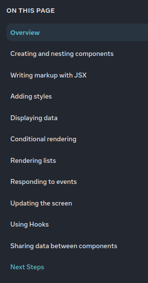
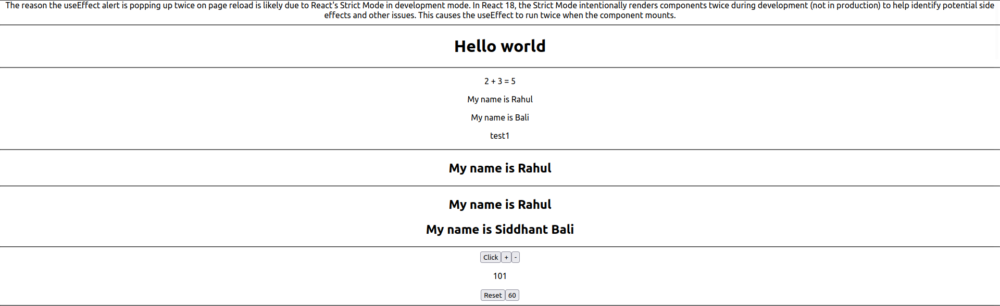
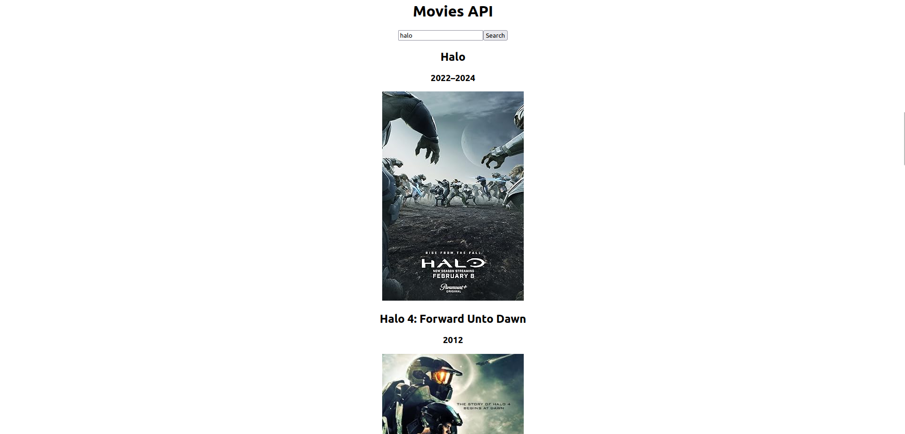

# REACT JS EMG

## Table of Contents
- [REACT JS EMG](#react-js-emg)
  - [Table of Contents](#table-of-contents)
  - [ReactJS](#reactjs)
  - [Component](#component)
  - [Functional component](#functional-component)
  - [Props](#props)
  - [State](#state)
  - [Hooks](#hooks)
  - [React's Strict Mode in development mode](#reacts-strict-mode-in-development-mode)
  - [JSX](#jsx)
  - [Egs](#egs)
  - [React Env Setup](#react-env-setup)
  - [Create React App](#create-react-app)
    - [Getting Started with Create React App](#getting-started-with-create-react-app)
    - [Available Scripts](#available-scripts)
      - [`npm start`](#npm-start)
      - [`npm test`](#npm-test)
      - [`npm run build`](#npm-run-build)
      - [`npm run eject`](#npm-run-eject)
    - [Learn More](#learn-more)
      - [Code Splitting](#code-splitting)
      - [Analyzing the Bundle Size](#analyzing-the-bundle-size)
      - [Making a Progressive Web App](#making-a-progressive-web-app)
      - [Advanced Configuration](#advanced-configuration)
      - [Deployment](#deployment)
      - [`npm run build` fails to minify](#npm-run-build-fails-to-minify)
  - [Node.js](#nodejs)
  - [File Structure](#file-structure)
    - [package.json :](#packagejson-)
    - [node\_modules :all dependicies/packages](#node_modules-all-dependiciespackages)
    - [src :all logic codes related to app development](#src-all-logic-codes-related-to-app-development)
    - [public :](#public-)
      - [public/index.html :main react app run in this single webpage ,contain metatags](#publicindexhtml-main-react-app-run-in-this-single-webpage-contain-metatags)
    - [src/index.js :](#srcindexjs-)
    - [src/App.js :](#srcappjs-)
  - [className](#classname)
  - [react fragment \<\>\</\>](#react-fragment-)
  - [API](#api)
  - [Others](#others)

## ReactJS
- React is js lib for making ui
- dev by fb and opensource
- easy
- crossplatform
- famous leader
- alternative : vue ,angular
- MernStack => any web app can be made
- uses virtualDOM, Superfast af as it only updates section of page where change is made,not whole page when it reloads
- not worry about js dom api
- fater than real dom

## Component
- import react : to use tools of lib
- react is component based frontend library
  - all stuff is split into independent reuseable components called componets
  - side bar ,searchbar ,sections etc.
  - types
    - func
    - class based (deprecated)
  
## Functional component
- no more class based madness
```js
import React from 'react'  ///there is no need to write this in todays gen

// arrow function comp.
const Example = () => {return (<div>HelloWorld</div>);};
```
- eg
```js
// Component to display a person's name
const Person = () => {
  return (
    <h2>My name is Rahul</h2>
  );
};
// Main App component
const App = () => {
  const [count, setCount] = useState(0);

  useEffect(() => {
    alert('useEffect');
    setCount(101);
  }, []);

  const name = "Rahul";
  const x = false;

  return (
    <div className="App">
      {/* Render Person component */}
      <Person />
      <hr />
  );
};

export default App;
```
## Props
- dynamic data oops type shit
- eg
```js
import './App.css';
// Component to display a person's name with props
const Person1 = ({ name, name2 }) => {
  return (
    <h2>My name is {name} {name2}</h2>
  );
};

const Person1 = (props) => {
  return (
    <h2>My name is {props.name} {props.name2}</h2>
  );
};


// Main App component
const App = () => {

  return (
    <div className="App">
      {/* Render Person1 component with different props */}
      <Person2 name="Rahul" />
      <Person1 name="Siddhant" name2="Bali" />
      {/* {'textonly'} */}
      <Person1 name={'Siddhant'} name2={'Bali'} />
      <hr />
    </div>
  );
};

export default App;
```
## State
- State is a plain js obj used by react to represent peice of information about compononets current situation
- completely managed by component itself
- Whenever we call function named first with 'use-' ,in react it called HOOK
- EVENT :its an action that can be triggred as a result of user action or system generated
- Dynamic stuff without website reload
- CALLBACK FUNCTION : ()  => command
  - eg :`onClick={() => alert('clicked')}`
```js
import './App.css';
import React, { useState, useEffect } from 'react';
import MovieCard from './MovieCard';


// Main App component
const App = () => {
  const [count, setCount] = useState(0);

  useEffect(() => {
    alert('useEffect');
    setCount(101);
  }, []);

  return (
    <div className="App">
      The reason the useEffect alert is popping up twice on page reload is likely due to React's Strict Mode in development mode. In React 18, the Strict Mode intentionally renders components twice during development (not in production) to help identify potential side effects and other issues. This causes the useEffect to run twice when the component mounts.
      

      {/* Buttons to handle alerts and count */}
      <button onClick={() => alert('clicked')}>Click</button>
      <button onClick={() => setCount(count + 1)}>+</button>
      <button onClick={() => setCount((prevCount) => prevCount - 1)}>-</button>
      <p>{count}</p>
      <button onClick={() => setCount(0)}>Reset</button>
      <button onClick={() => setCount(60)}>60</button>
    </div>
  );
};

export default App;

```

## Hooks
- [REACT DOC](https://react.dev/reference/react/hooks)
- Whenever we call function named first with 'use-' ,in react it called HOOK.
- eg :useEffect used at initial load
```js
  useEffect(() => {
    alert('useEffect');
    setCount(101);
    
  }, []);
  ```
- eg :useEffect used at  whenever counter updates, make alert info update 
```js
  useEffect(() => {
    alert('u changed counter to'+counter);
  }, [counter]);
  ```
- `not Count = 101; //use oops`
- `useEffect` is a hook that allows us to run some code after the component has been

## React's Strict Mode in development mode
- React 18 introduced a new feature called Strict Mode, which is enabled by default in development mode
The reason the useEffect alert is popping up twice on page reload is likely due to React's Strict Mode in development mode. In React 18, the Strict Mode intentionally renders components twice during development (not in production) to help identify potential side effects and other issues. This causes the useEffect to run twice when the component mounts.


## JSX
- js xml
- html +js = JSX
- straigth js insert bw html
- dynamic real time data changes ,COOL
- template language
- Sample eg
```js
import logo from './logo.svg';
import './App.css'
function App() {return(
    <div className="App">
    <p>2 + 2 = {2 + 2}</p>
    
    </div>

);};

export deafault App;
```
- eg
```js 
import './App.css';
import React, { useState, useEffect } from 'react';
import MovieCard from './MovieCard';

// Component to display a person's name
const Person = () => {
  return (
    <h2>My name is Rahul</h2>
  );
};

const APIURL = 'https://www.omdbapi.com?apikey=eb86c609';

// Component to display a person's name with props
const Person1 = ({ name, name2 }) => {
  return (
    <h2>My name is {name} {name2}</h2>
  );
};

const movie1 = {
  "Title": "The Batman",
  "Year": "2022",
  "imdbID": "tt1877830",
  "Type": "movie",
  "Poster": "https://m.media-amazon.com/images/M/MV5BOGE2NWUwMDItMjA4Yi00N2Y3LWJjMzEtMDJjZTMzZTdlZGE5XkEyXkFqcGdeQXVyODk4OTc3MTY@._V1_SX300.jpg"
}

// Component to fetch and display movies
const Movies = () => {
  const [movies, setMovies] = useState([]);
  const [searchTerm, setSearchTerm] = useState(''); // New state to store search term

  // Fetch data from API
  const fetchData = async (title) => {
    try {
      const response = await fetch(`${APIURL}&s=${title}`);
      const data = await response.json();
      setMovies(data.Search);
    } catch (error) {
      console.error('Error fetching data:', error);
    }
  };

  // Handle search button click
  const handleSearch = () => {
    fetchData(searchTerm); // Trigger fetchData with the current search term when button is clicked
  };

  return (
    <div className="movies">
      <h1>Movies API</h1>
      <div className="search">
        <input
          type="text"
          placeholder="Search..."
          value={searchTerm}
          onChange={(e) => setSearchTerm(e.target.value)}
        />
        <button onClick={handleSearch}>Search</button>
      </div>
      <div className="movie-list">
        {/* Conditional rendering for fetched movies */}
        {movies?.length > 0 ? (
          movies.map((movie) => (
            <MovieCard key={movie.imdbID} movie={movie} />
          ))
        ) : (
          <p>No movies found</p>
        )}
      </div>
    </div>
  );
};

// Main App component
const App = () => {
  const [count, setCount] = useState(0);

  useEffect(() => {
    alert('useEffect');
    setCount(101);
  }, []);

  const name = "Rahul";
  const x = false;

  return (
    <div className="App">
      The reason the useEffect alert is popping up twice on page reload is likely due to React's Strict Mode in development mode. In React 18, the Strict Mode intentionally renders components twice during development (not in production) to help identify potential side effects and other issues. This causes the useEffect to run twice when the component mounts.
      <hr />
      <h1>Hello world</h1>
      <hr />

      <p>2 + 3 = {2 + 3}</p>
      <p>My name is {name}</p>
      <p>My name is {x ? name : "Bali"}</p>

      {/* Conditional rendering with ternary operator */}
      {name ? (
        <p>test1</p>
      ) : (
        <p>test2, there is no name</p>
      )}
      <hr />

      {/* Render Person component */}
      <Person />
      <hr />

      {/* Render Person1 component with different props */}
      <Person1 name="Rahul" />
      <Person1 name="Siddhant" name2="Bali" />
      <hr />

      {/* Buttons to handle alerts and count */}
      <button onClick={() => alert('clicked')}>Click</button>
      <button onClick={() => setCount(count + 1)}>+</button>
      <button onClick={() => setCount(count - 1)}>-</button>
      <p>{count}</p>
      <button onClick={() => setCount(0)}>Reset</button>
      <button onClick={() => setCount(60)}>60</button>

      <hr />
      <p>{movie1.Title}</p>
      <p>{movie1.Year}</p>
      
      <p>{movie1.imdbID}</p>
      <hr />
      {/* Render MovieCard component */}
      <MovieCard movie={movie1} />
      <hr />

      {/* Render Movies component */}
      <Movies />
    </div>
  );
};

export default App;

```
## Egs

## React Env Setup
- Manual
- create-react-app

## Create React App
- tool to install react framework and libs(react, react-dom, react-scripts, etc.)
- Basically give base template for stable updated react app
- offical
- new folder
```bash
npx create-react-app appname
```
- current dir
```bash
npx create-react-app ./
```
- pre-require node js install
### Getting Started with Create React App

This project was bootstrapped with [Create React App](https://github.com/facebook/create-react-app).

### Available Scripts

In the project directory, you can run:

#### `npm start`

Runs the app in the development mode.\
Open [http://localhost:3000](http://localhost:3000) to view it in your browser.

The page will reload when you make changes.\
You may also see any lint errors in the console.

#### `npm test`

Launches the test runner in the interactive watch mode.\
See the section about [running tests](https://facebook.github.io/create-react-app/docs/running-tests) for more information.

#### `npm run build`

Builds the app for production to the `build` folder.\
It correctly bundles React in production mode and optimizes the build for the best performance.

The build is minified and the filenames include the hashes.\
Your app is ready to be deployed!

See the section about [deployment](https://facebook.github.io/create-react-app/docs/deployment) for more information.

#### `npm run eject`

**Note: this is a one-way operation. Once you `eject`, you can't go back!**

If you aren't satisfied with the build tool and configuration choices, you can `eject` at any time. This command will remove the single build dependency from your project.

Instead, it will copy all the configuration files and the transitive dependencies (webpack, Babel, ESLint, etc) right into your project so you have full control over them. All of the commands except `eject` will still work, but they will point to the copied scripts so you can tweak them. At this point you're on your own.

You don't have to ever use `eject`. The curated feature set is suitable for small and middle deployments, and you shouldn't feel obligated to use this feature. However we understand that this tool wouldn't be useful if you couldn't customize it when you are ready for it.

### Learn More

You can learn more in the [Create React App documentation](https://facebook.github.io/create-react-app/docs/getting-started).

To learn React, check out the [React documentation](https://reactjs.org/).

#### Code Splitting

This section has moved here: [https://facebook.github.io/create-react-app/docs/code-splitting](https://facebook.github.io/create-react-app/docs/code-splitting)

#### Analyzing the Bundle Size

This section has moved here: [https://facebook.github.io/create-react-app/docs/analyzing-the-bundle-size](https://facebook.github.io/create-react-app/docs/analyzing-the-bundle-size)

#### Making a Progressive Web App

This section has moved here: [https://facebook.github.io/create-react-app/docs/making-a-progressive-web-app](https://facebook.github.io/create-react-app/docs/making-a-progressive-web-app)

#### Advanced Configuration

This section has moved here: [https://facebook.github.io/create-react-app/docs/advanced-configuration](https://facebook.github.io/create-react-app/docs/advanced-configuration)

#### Deployment

This section has moved here: [https://facebook.github.io/create-react-app/docs/deployment](https://facebook.github.io/create-react-app/docs/deployment)

#### `npm run build` fails to minify

This section has moved here: [https://facebook.github.io/create-react-app/docs/troubleshooting#npm-run-build-fails-to-minify](https://facebook.github.io/create-react-app/docs/troubleshooting#npm-run-build-fails-to-minify)


## Node.js
- js runtime to execute js commands on server
- [Node.js Download](https://nodejs.org/en)

## File Structure
### package.json :
- all dependicies/packages installed information,helps during `npm install`
### node_modules :all dependicies/packages 
### src :all logic codes related to app development
### public :
#### public/index.html :main react app run in this single webpage ,contain metatags
  - all react components injected in this `<div id =root></div>`
```html
<!DOCTYPE html>
<html lang="en">
  <head>
    <meta charset="utf-8" />
    <link rel="icon" href="%PUBLIC_URL%/favicon.ico" />
    <meta name="viewport" content="width=device-width, initial-scale=1" />
    <meta name="theme-color" content="#000000" />
    <meta
      name="description"
      content="Web site created using create-react-app"
    />
    <link rel="apple-touch-icon" href="%PUBLIC_URL%/logo192.png" />
    <link rel="manifest" href="%PUBLIC_URL%/manifest.json" />
    <title>React App</title>
  </head>
  <body>
    <noscript>You need to enable JavaScript to run this app.</noscript>
    <div id="root"></div>
  </body>
</html>
```
```html
<!DOCTYPE html>
<html lang="en">
  <head>
    <meta charset="utf-8" />
    <link rel="icon" href="%PUBLIC_URL%/favicon.ico" />
    <meta name="viewport" content="width=device-width, initial-scale=1" />
    <meta name="theme-color" content="#000000" />
    <meta
      name="description"
      content="Web site created using create-react-app"
    />
    <link rel="apple-touch-icon" href="%PUBLIC_URL%/logo192.png" />
    <!--
      manifest.json provides metadata used when your web app is installed on a
      user's mobile device or desktop. See https://developers.google.com/web/fundamentals/web-app-manifest/
    -->
    <link rel="manifest" href="%PUBLIC_URL%/manifest.json" />
    <!--
      Notice the use of %PUBLIC_URL% in the tags above.
      It will be replaced with the URL of the `public` folder during the build.
      Only files inside the `public` folder can be referenced from the HTML.

      Unlike "/favicon.ico" or "favicon.ico", "%PUBLIC_URL%/favicon.ico" will
      work correctly both with client-side routing and a non-root public URL.
      Learn how to configure a non-root public URL by running `npm run build`.
    -->
    <title>React App</title>
  </head>
  <body>
    <noscript>You need to enable JavaScript to run this app.</noscript>
    <div id="root"></div>
    <!--
      This HTML file is a template.
      If you open it directly in the browser, you will see an empty page.

      You can add webfonts, meta tags, or analytics to this file.
      The build step will place the bundled scripts into the <body> tag.

      To begin the development, run `npm start` or `yarn start`.
      To create a production bundle, use `npm run build` or `yarn build`.
    -->
  </body>
</html>

```
### src/index.js :
  - `import ReactDOM from 'react-dom' ;` Only called once in this code,in entire react application
  - react dom helps in render components and entire app into real dom(where div id = root)
```js
import React from 'react';
import ReactDOM from 'react-dom';
import './index.css';
import App from './App';

const root = ReactDOM.createRoot(document.getElementById('root'));
root.render(
  <React.StrictMode>
    <App />
  </React.StrictMode>
);
```
### src/App.js :
- Main App containing `function App() {return();};` or `const App = () = {return();}; `

## className
- class in js is reserved keyword
- so we use className for class attribute

## react fragment <></>
- if you have to wrap 2 elements ,one next to other ,use this
```
<>
</>
```
- Sample eg
```js
import logo from './logo.svg';
import './App.css'
function App() {return(
    <>
    {name ? (
        <><p>test1</p></>
    ) : (
        <><p>test2, there is no name</p></>
    )}
    </>

);};

export deafault App;
```
## API
- API stands for Application Programming Interface
- eg :omdb free api


## Others
- [REad All of docs](https://react.dev/learn#)



```js
import './App.css';
import React, { useState, useEffect } from 'react';

const movie1 = {
  "Title": "The Batman",
  "Year": "2022",
  "imdbID": "tt1877830",
  "Type": "movie",
  "Poster": "https://m.media-amazon.com/images/M/MV5BOGE2NWUwMDItMjA4Yi00N2Y3LWJjMzEtMDJjZTMzZTdlZGE5XkEyXkFqcGdeQXVyODk4OTc3MTY@._V1_SX300.jpg"
}

// Component to fetch and display movies
const Movies = () => {
  const [movies, setMovies] = useState([]);
  const [searchTerm, setSearchTerm] = useState(''); // New state to store search term

  // Fetch data from API
  const fetchData = async (title) => {
    try {
      const response = await fetch(`${APIURL}&s=${title}`);
      const data = await response.json();
      setMovies(data.Search);
    } catch (error) {
      console.error('Error fetching data:', error);
    }
  };

  // Handle search button click
  const handleSearch = () => {
    fetchData(searchTerm); // Trigger fetchData with the current search term when button is clicked
  };

  // Corrected props destructuring
  const MovieCard = ({ movie }) => {
    return (
      <div className="movie">
        <h2>{movie.Title}</h2>
        <h3>{movie.Year}</h3>
        
      </div>
    );
  }


  return (
    <div className="movies">
      <h1>Movies API</h1>
      <div className="search">
        <input
          type="text"
          placeholder="Search..."
          value={searchTerm}
          onChange={(e) => setSearchTerm(e.target.value)}
        />
        <button onClick={handleSearch}>Search</button>
      </div>
      <div className="movie-list">
        {/* Conditional rendering for fetched movies */}
        {movies?.length > 0 ? (
          movies.map((movie) => (
            <MovieCard key={movie.imdbID} movie={movie} />
          ))
        ) : (
          <p>No movies found</p>
        )}
      </div>
    </div>
  );
};

// Main App component
const App = () => {
  useEffect(() => {
    alert('useEffect');
  }, []);

  return (
    <div className="App">
      <p>{movie1.Title}</p>
      <p>{movie1.Year}</p>
      
      <p>{movie1.imdbID}</p>
      <hr />
      {/* Render MovieCard component */}
      <MovieCard movie={movie1} />
      <hr />

      {/* Render Movies component */}
      <Movies />
    </div>
  );
};

export default App;

```





