# TAILWIND CSS EMG

## Table of Contents 
- [TAILWIND CSS EMG](#tailwind-css-emg)
  - [Table of Contents](#table-of-contents)
  - [Tailwind](#tailwind)
  - [Basics](#basics)
  - [Layout](#layout)
    - [Position](#position)
    - [Display](#display)
      - [Flex](#flex)
      - [Grid](#grid)
  - [Media Queries](#media-queries)
  - [Hover \& Focus](#hover--focus)
  - [Lists :First ,Second ,Odd ,Even](#lists-first-second-odd-even)
  - [Dark Mode](#dark-mode)
  - [Shadow](#shadow)
  - [Ring](#ring)
  - [Custom Styles](#custom-styles)
    - [way1 : \[\] ,putting custom commands in sq. brac.](#way1---putting-custom-commands-in-sq-brac)
    - [way2 : tailwind config \&Reuseability of CSS](#way2--tailwind-config-reuseability-of-css)
    - [way3 : use component libraries like Tailwindui, headlessui, shadcn/ui](#way3--use-component-libraries-like-tailwindui-headlessui-shadcnui)

## Tailwind
- Tailwind is a utility-first CSS framework that allows you to write more concise and maintainable CSS code
- mordern
- responsive
- complete control over customisation
- UI Libs :Tailwindui, headlessui, shadcn/ui
- chatgpt, microsoft, shopify, github, nasa etc....use it
- traditional css made us to write the each class css code and  then apply it to the html element
- Tailwind css automatically genetate css classes code when we use it in our html element
- [Tailwind Practice Playground](https://play.tailwindcss.com/)
- it has JIT compliler (JustInTime)
  - Speeds up the build process 
  - Support custom styles
  - Keeps the Css consistent in both dev and prod
  - improves how websites perform in browsers
  - INBUILT in tailwind ;0
- we can make our oun classes in it too,resulting in more EFFICENT &OPTIMISED app
- Tailwind is not a CSS framework, it's a utility-first CSS framework


## Basics
```html
<main class="p-5">
0 p-5
<h1>1 Hello World<h1>
<h1 class="text-center text-lg text-blue-400">2 text-center text-lg text-blue-400<h1>
<div class=" w-full h-20 bg-violet-500 border-pink-600 border-3 rounded-md my-4 mx-4 p-2"><p class="text-center font-mono font-extrabold">3 w-full h-10 bg-violet-500 border-pink-600 border-3 rounded-md my-4 mx-4 p-2 text-center font-mono font-extrabold</p></div>
<p class=" text-[33px]">4 text-[33px]</p>
<pre>
[] will help to make a custom made css 
.text-\[33px\] {
  font-size: 33px;
}
</pre>
</main>
```
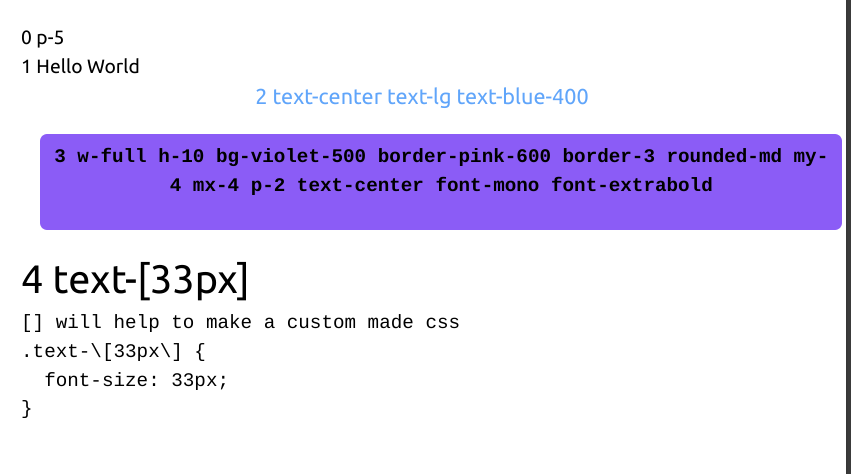

## Layout
- arrangements and positioning of elements on the website
- Aspect
- Box sizing
- Float
- Display
- Position
- Overflow
- Z-index 
  
### Position
- determine how html element is positioned within its containing element or overall website
- relative :shifts a bit,but everything behaves as it still's here
- absolute :makes element to move independently like puzzle piece on a nearby parent or whole page
- fixed :makes element stay fixed and sticky even when user scrolls
```html
fixed w-10 h-10 bg-red-400 top-0
<div class="fixed w-10 h-10 bg-red-400 top-0">5</div>
```  
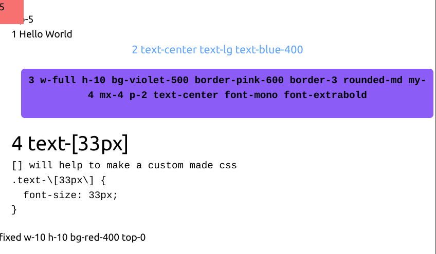
### Display
- determines how the element behaves in terms of layout and visibility within the document.
- controls how the element are displayed.
  - block
  - inline
  - inline block
  - none 
  - flex
  - grid
#### Flex
- the moment you master flex ,you can flex at anything.
- [ ][Flexbox Froggy](https://flexboxfroggy.com/)
```html
<!-- Display -->
6 flex justify-center space-x-2
<div class="flex justify-center space-x-2">
  <div class=" h-8 w-8 rounded-full bg-slate-500">6</div>
  <div class=" h-8 w-8 rounded-full bg-slate-600">6</div>
  <div class=" h-8 w-8 rounded-full bg-slate-700">6</div>
</div>
6 flex justify-between
<div class="flex justify-between">
  <div class=" h-8 w-8 rounded-full bg-slate-500">6</div>
  <div class=" h-8 w-8 rounded-full bg-slate-600">6</div>
  <div class=" h-8 w-8 rounded-full bg-slate-700">6</div>
</div>
```
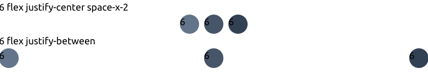
#### Grid
```html
7 grid grid-cols-5 gap-2 mt-3
<div class="grid grid-cols-5 gap-2 mt-3">
  <div class=" bg-violet-300 h-12"></div>
    <div class=" bg-violet-300 h-12"></div>
      <div class=" bg-violet-300 h-12"></div>
        <div class=" bg-violet-300 h-12"></div>
          <div class=" bg-violet-300 h-12"></div>
</div>
```
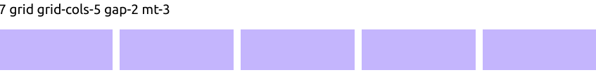
## Media Queries
- tailwind gives 5 breakpoints
- you can make your custom too
- Breakpoint prefix	Minimum width	CSS
  - sm	640px	@media (min-width: 640px) { ... } DEFAULT
  - md	768px	@media (min-width: 768px) { ... }
  - lg	1024px	@media (min-width: 1024px) { ... }
  - xl	1280px	@media (min-width: 1280px) { ... }
  - 2xl	1536px	@media (min-width: 1536px) { ... }
```html
8 Media queries
<div class=" md:block hidden">
  <p>Resolution > 768px md:block hidden</p>
</div>
<div class=" max-md:block hidden">
  <p>Resolution < 768px max-md:block hidden</p>
```

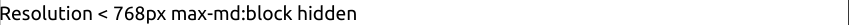
## Hover & Focus
```html
9 Hover &Focus :
<br> my-2 rounded-lg bg-black px-3 py-2 text-yellow-400 hover:bg-slate-700 focus:outline-none focus:ring-yellow-500 active:bg-slate-400 hover:text-yellow-400
<button class="my-2 rounded-lg bg-black px-3 py-2 text-yellow-400 hover:bg-slate-700 focus:outline-none focus:ring-yellow-500 active:bg-slate-400 hover:text-yellow-400">Click Me</button>
```
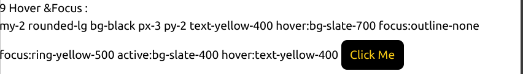
## Lists :First ,Second ,Odd ,Even
- here attributes only run when they were first ,second ,odd or even respectively.
- just see point number and thei properties based on their  position
```html
<div>
  10 Lists :First ,Second ,Odd ,Even
  <br>
  my-2 space-y-2 space-x-2
  <ul class="my-2 space-y-2 space-x-2">
    <li class="bg-white p-2 first:bg-slate-950 first:text-white">1 bg-white p-2 first:bg-slate-950 first:text-white</li>
    <li class="bg-white p-2 first:bg-slate-950 first:text-white odd:bg-blue-300 even:bg-red-300">2 bg-white p-2 first:bg-slate-950 first:text-white odd:bg-blue-300 even:bg-red-300</li>
    <li class="bg-white p-2 first:bg-slate-950 first:text-white odd:bg-blue-300 even:bg-red-300">3 bg-white p-2 first:bg-slate-950 first:text-white odd:bg-blue-300 even:bg-red-300</li>
    <li class="bg-white p-2 first:bg-slate-950 first:text-white odd:bg-blue-300 even:bg-red-300">4 bg-white p-2 first:bg-slate-950 first:text-white odd:bg-blue-300 even:bg-red-300</li>
    <li class="bg-white p-2 first:bg-slate-950 first:text-white odd:bg-blue-300 even:bg-red-300">5 bg-white p-2 first:bg-slate-950 first:text-white odd:bg-blue-300 even:bg-red-300</li>
  </ul>
</div>
```
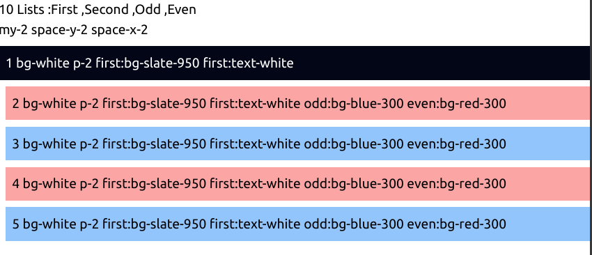
## Dark Mode
- styling up light and dark theme is easier than ever
- 1st put darkmode : "class", at config file, i.e. based on simple class we will be able to change the theme
- if you dont specify toggle and theme in code complier with automatically use os theme
```js
/** @type {import('tailwindcss').Config} */
export default {
  darkMode: "class",
  theme: {
    extend: {
      // ...
    },
  },
  plugins: [],
}

```
- darkmode script
```js
document.addEventListener("DOMContentLoaded", () => {
    const toggleDark = document.getElementById('toggleDark')
    toggleDark.addEventListener('click', function() {
      if(document.documentElement.classList.includes('dark')) {
        document.documentElement.classList.remove('dark')
      }
      else {
        document.documentElement.classList.add('dark')
      }
      alert("click!")
    });
  });
```
- code eg:
```html
<main>

<!-- Theme Dark -->
11 Theme Dark <br>
m-10 rounded-lg bg-white px-6 py-8 shadow-xl ring-2 ring-slate-900/5 dark:bg-black
<div class="m-10 rounded-lg bg-white px-6 py-8 shadow-xl ring-2 ring-slate-900/5 dark:bg-black">
  <h3 class="text-base font-medium tracking-tight text-slate-900 dark:text-white">text-base font-medium tracking-tight text-slate-900 dark:text-white</h3>
  <p class="mt-2 text-sm text-slate-500 dark:text-blue-100">mt-2 text-sm text-slate-500 dark:text-blue-100</p>
  <br>
      id="toggleDark"
    class="text-blue-900 px-4 py-2 text-sm font-medium mt-8 bg-blue-100 rounded-md"
  <button
    id="toggleDark"
    class="text-blue-900 px-4 py-2 text-sm font-medium mt-8 bg-blue-100 rounded-md"
    onclick="document.body.classList.toggle('dark')">document.body.classList.toggle('dark')</button>

</div>

</main>
// To showcase the demo of dark theme. Copy paste :)
<script type="text/javascript">
  document.addEventListener("DOMContentLoaded", () => {
    const toggleDark = document.getElementById('toggleDark')
    toggleDark.addEventListener('click', function() {
      if(document.documentElement.classList.includes('dark')) {
        document.documentElement.classList.remove('dark')
      }
      else {
        document.documentElement.classList.add('dark')
      }
      alert("click!")
    });
  });
</script>
```
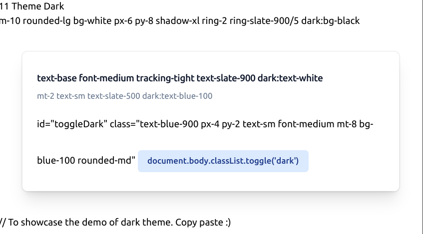
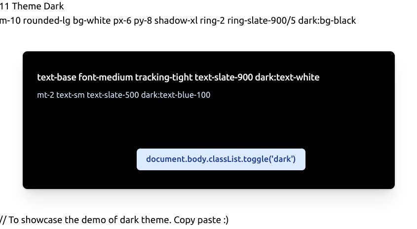
## Shadow
## Ring
## Custom Styles
- 2 ways
### way1 : [] ,putting custom commands in sq. brac.
```html
<p class="text-[12px] text-[#973F29] bg-stone-200 p-[17px]">12 text-[12px] text-[#973F29] bg-stone-200 p-[17px]</p>
```
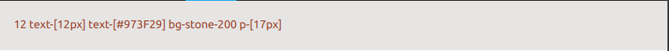
### way2 : tailwind config &Reuseability of CSS
- seemless control
- extend: extrend predefined styles
```js
/** @type {import('tailwindcss').Config} */
export default {
  darkMode: "class",
  theme: {
    extend: {
      colors: {
        chestnut: '#973F29'
      }
      // ...
    },
  },
  plugins: [],
}
```
- `colours` are`colors` in coding
- usage :
```html
<p class="text-[12px] text-[#973F29] bg-stone-200 p-[17px]">12 text-[12px] text-[#973F29] bg-stone-200 p-[17px]</p>
<p class="text-[12px] text-chestnut bg-stone-200 p-[17px]">text-[12px] text-chestnut bg-stone-200 p-[17px]</p>

```
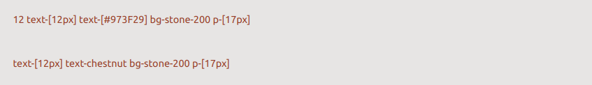
- Break your layoit into specific components
- Use directives
  - why is this in .css? these are parts of approach of organizing and structuring the configuration method
```css
@tailwind base;
@tailwind components;
@tailwind utilities;
```
  - base styles directive :applied globally across proj
  - components d :applied to components/ reuseable ui elements
  - utilities d :atominc styles for individual properties like margins,padding,typo graphy
- using custom directives
```css
@tailwind base;
@tailwind components;
@tailwind utilities;

@layer components { 
  .card {
    @apply m-10 rounded-lg bg-white px-6 py-8 shadow-xl ring-2 ring-slate-900/5 dark:bg-black
  }
}

```
- usage
```html

<div class="card">12 card 
  <pre>
@layer components { 
  .card {
    @apply m-10 rounded-lg bg-white px-6 py-8 shadow-xl ring-2 ring-slate-900/5 dark:bg-black
  }
}
  </pre>
</div>
<div class="card"></div>
```
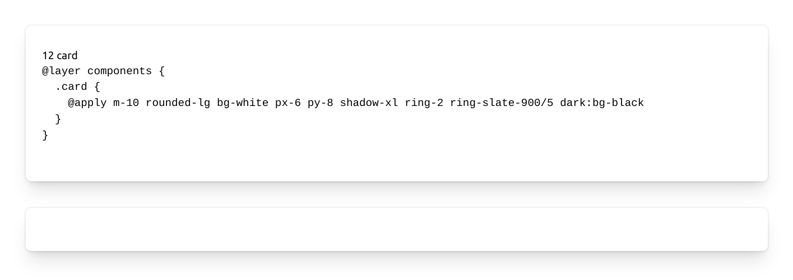
### way3 : use component libraries like Tailwindui, headlessui, shadcn/ui
